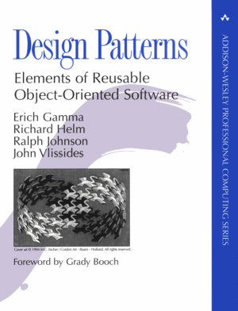

# 2. Основы паттернов ООП

### Noveo University — iOS


----

## Сегодня

* MVC
* MVP
* MVVM
* Delegate
* Observer
* Singleton


----

## Архитектура приложения
### Мотивация

<!---->

* Уменьшение беспорядка в коде

* Уменьшение уровня вхождения в проект

<!---->
<!-- .element: class="fragment" -->


----

## Архитектура приложения
### Понятие шаблона

Шаблон - абстрактное описание класса задач и подхода для их решения
<!-- .element: class="fragment" -->


----

## Архитектура приложения
### Преимущества использования шаблонов

* Наличие в проекте определенной (общеизвестной) терминологии

* Предсказуемость структуры нового кода

* Как следствие, наличие возможности более простого погружения в логику работы конкретного модуля и межмодульного взаимодействия в целом

Note:

Мы целенаправленно загоняем себя в рамки.

Нужно задумываться не только об узких целях разрабатываемого модуля, но и о читабельности и масштабируемости данного модуля.


----

## Model-View-Controller

* "Single View Application" - заготовка для работы в контексте MVC

* "AppDelegate" - содрежит логику обработки событий на уровне всего приложения

* "ViewController" - содержит логику взаимодействия с экраном

Note:

"AppDelegate": обработка таких событий как "запуск приложения", "начало работы в фоне", "принудительное завершение", ... 

"ViewController": обработка нажатий на кнопки, ввода текста, сохранения данных, ...   


----

## Model-View-Controller

* Весь код делится на три слоя

* Каждый объект попадает только в один из слоев

* Слои не зависят друг от друга


----

## Model-View-Controller
### Model

* Хранит данные приложения

* Реализует бизнес логику


----

## Model-View-Controller
### View

* Все, что видит пользователь

* Все с чем взаимодействует пользователь


----

## Model-View-Controller
### Controller

* Слой, отвечающий за связывание View и Model

* Управляет жизненным циклом приложения

* Обрабатывает действия пользователя

* Содержит бизнес-логику


----

## Model-View-Controller


----

## Model-View-Controller
### Massive-View-Controller


Note:

UIView = View, UIViewController = Controller 

Внутри такой структуры, имеется тесная связь между UIView и UIViewController.
Появляется соблазн писать все внутри UIViewController.

MVC хороший шаблон, но в контексте iOS поялвяется много соблазнов писать неправильно.  


----

## Model-View-Controller

Плюсы:

* Легко ложиться на архитектуру Apple

* Просто и понятно выглядит для небольших проектов

Минусы:

* Плохая масштабируемость (Massive-View-Controller)

* Плохая тестируемость

Note:

Речь идет именно об VMC в контексте iOS.


----

## Model-View-Presenter
### View

* UIViewController относится к слою View


Note:

По сути, MVP запрещает UIViewController знать об объектах слоя Model, что является важдым отличием от MVC.


----

## Model-View-Presenter
### Presenter

* Не содержит layout-кода

* Не имеет отношения к жизненному циклу   


----

## Model-View-Presenter


Note:

В некотором смысле, развитие MVC, где часть обязанностей Controller отдали View.

Хорошей практикой будет осуществление взаимодействия от View к Presenter через протокол, что позволит еще больше обособить два слоя приложения. 


----

## Model-View-Presenter

Плюсы:

* Хорошая тестируемость

* Хороший баланс обязанностей между слоями

Минусы:

* Нужно писать больше кода

Note:

Много кода - не значит усложнять приложение, а при наличии правильных мыслей, даже наоборот.

"Simple not easy"


----

## Model-View-View Model
### View Model

* Ничего не знает о View

* Предоставляет наружу набор полей, к которым можно "привязаться"


----

## Model-View-View Model


Note:

Ключевой момент: связывание View и View Model с помощью binding.

Хорошая практика: видимость View Model из View через протокол. 


----

## Model-View-View Model
### Bindings

Вспомогательные компоненты:

* KVO

* Notifications

Готовые решения:

* ReactiveCocoa

* RxSwift

Note:

Недостатки второго подхода: сложность отладки (огромный стэк вызовов), высокий порог вхождения.

Решение: "Писать код так, чтобы не нужно было отлаживать".


----

## Пример
### MVC


----

## Пример
### MVC


Note:

Что из себя представляет Controller и как он будет взаимодействовать с объектами Model?


----

## Пример
### MVC


Note:

Проблематично загрузить в память сразу все записи.

Как View будет общаться с Controller? Например, долистав до 100 записи в таблице, как View узнает что нужно показать на 101 строке?

Проблема: View (UITableView) - класс из страндартной библиотеки, Controller - класс который мы только что написали, как их связать?


----

## Пример
### Delegate


Note:

У View есть объект, который гарантированно отвечает на определенный набор команд. Controller - реализует этот набора команд (реализует некоторый протокол).

View видит Controller сквозь протокол.


----

## Пример
### MVC


Note:

Разные объекты Controller могут доступаться до одной и того же объекта Model.

Проблема: В Model поступили новые данные, как об этом узнает объект (объекты) Controller?


----

## Пример
### Observer


Note:

У объекта Model есть массив объектов, реализующих определенный протокол. Любой объект может добавиться в этот массив (подписаться) или удалиться из него (отписаться).

При обновлении объекта Model, каждому объекту из массива будет вызван метод, уведомляющий об обновлении Model. 


----

## Singleton

Гарантируюет, что в приложении будет единственный экземпляр определенного класса с глобальной точкой доступа.

Note:

Доступаться могут все. Доступаются к одному и тому же объекту.


----

## Singleton

Плюсы:

* Клиентам не нужно заботиться об инициализации объект

* Объект легко доступен всем

Минусы:

* Связи в коде становятся неявными

* Затруднено масштабирование проекта

* Затруднено переиспользование отдельных модулей

* Затруднена изоляция модулей

Note:

Примеры проблем: переход от однопользовательской модели к многопользовательской, unit-тестирование.


----

## Singleton
### Пример реализации:

```ObjectiveC

// SomeSingleton.m

@implementation SomeSingleton

+ (SomeSingleton *)sharedInstance
{
	static SomeSingleton *_sharedInstance = nil;
    
    if (_sharedInstance == nil) {
        _sharedInstance = [[Singleton alloc] init];
    }
	
	return _sharedInstance;
}

@end

```

Note:

Упрощенный (в частности, не потокобезопасный) код, но отражает суть.


----

## Singleton
### Примеры из стандартных библиотек:

```ObjectiveC
[NSUserDefaults standardUserDefaults]
```

```ObjectiveC
[UIApplication sharedApplication]
```

```ObjectiveC
[UIScreen mainScreen]
```


----

## Рекомендуемая литература

- "Шаблоны проектирования" от "Банды Четырёх"<br>


- "Архитектурные паттерны в iOS"<br>
Хабрахабр: https://habrahabr.ru/company/badoo/blog/281162/
