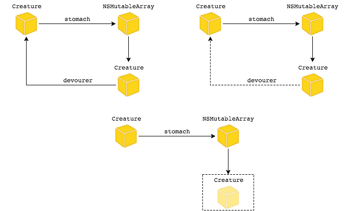

# Управление памятью

### Noveo University — iOS


----

## Сегодня

* Повторение
* Manual Retain-Release
* Autorelease pools


----

## Типы памяти

* __Статическая память__ содержит глобальные и статические скалярные переменные и ссылки на объекты
* __Локальная (стековая) память__ выделяется при входе в подпрограмму (метод, функцию) и освобождается при выходе из нее
* __Динамическая память__ выделяется в рантайме и управляется кодом


----

## Эффективное управление памятью

Использование номинально необходимого объема выделяемой памяти, достигается за счет:
* Выделения памяти по необходимости
* Совместного использования данных
* Своевременного удаления ненужных объектов (данных)


----

# Manual Retain-Release


----

## Основные положения

* Управление памятью объектов базируется на объектом "владении" (ownership)
* К управлению связями между объектами следует подходить с позиции "объектных графов". *Объектный граф - группа объектов, которые соединены в сеть по средствам установления тех или иных отношений между ними.*
* Объект живет пока имеет одного или нескольких владельцев
* Объект умирает когда больше не имеет владельцев


----

## Объектный граф


----

## Основные положения

* Методы `alloc`, `new`, `copy`, `mutableCopy` возвращают объекты с счетчиком ссылок равным единице
* Метод `retain` увеличивает счетчик на единицу
* Метод `release` уменьшает счетчик на единицу
* Метод `autorelease` выполняет отложенное уменьшение счетчика на единицу
* Объект умирает (вызывается метод `dealloc`) когда счетчик ссылок достигает нуля
* Вы не должны отказываться от владения объектом если вы его не создавали
* Вы не владеете объектами, возвращенными по ссылке


----

## Пример

```ObjectiveC
NSMutableArray *array = [[NSMutableArray alloc] init];
NSLog(@"%ld", array.retainCount); //1
[array retain]; //2
[array retain]; //3
[array release]; //2
[array autorelease]; //2

NSMutableArray *arrayCopy = [array mutableCopy]; //1
[arrayCopy release]; //0
[arrayCopy release]; //Exception - zombie
```


----

## Пример


----

## Пример


----

## Владение объектами в пределах подпрограммы

* Создаем объекты когда они нужны
* Освобождаем когда они больше не нужны
* Отложенно освобождаем для возвращения "наверх"


----

## Пример

```ObjectiveC
- (NSString *)getTimeOfDate:(NSDate *)date
{
    NSDateFormatter *dateFormatter = [[NSDateFormatter alloc] init];
    dateFormatter.date = @"hh:mm";
    NSString *dateString = [dateFormat stringFromDate:date];
    [dateFormat release];

    return dateString;
}
```
Упрощенный вариант
```ObjectiveC
- (NSString *)getTimeOfDate:(NSDate *)date
{
    NSDateFormatter *dateFormatter = [[[NSDateFormatter alloc] init] autorelease];
    dateFormatter.date = @"hh:mm";
    return [dateFormat stringFromDate:date];
}
```


----

## Пример

```ObjectiveC
NSString *appendNewLineToString(NSString *string)
{
    NSString *result = [[NSString alloc] initWithFormat:@"%@\n", string];
    [result autorelease];
    return result;
}
```
Упрощенный вариант
```ObjectiveC
NSString *appendNewLineToString(NSString *string)
{
    return [[[NSString alloc] initWithFormat:@"%@\n", string] autorelease];
}
```
Еще проще
```ObjectiveC
NSString *appendNewLineToString(NSString *string)
{
    return [NSString stringWithFormat:@"%@\n", string];
}
```


----

## Пример

```ObjectiveC
NSError *error = nil;
NSString *string =
    [[NSString alloc]
        initWithContentsOfFile:fileName encoding:NSUTF8StringEncoding error:&error];
if (error) {
    //error processing
}
//...
[string release];
```


----

## Управление памятью в пределах объекта

Для грамотного владения объектом нужно:
* Создать объект либо завладеть объектом, полченным извне
* Сохранить ссылку на объект в переменной объекта-владыки
* Освободить объект и занулить ссылку когда он больше не нужен


----

## Пример

```ObjectiveC
@interface Person : NSObject {
    NSString *_lastName;
}
@end

@implementation Person

- (void)setLastName:(NSString *)lastName
{
    [lastName retain];
    [_lastName release];
    _lastName = lastName;
}

- (NSString *)lastName
{
    return _lastName
}

@end
```


----

## То же самое

```ObjectiveC
@interface Person : NSObject
@property (retain) NSString *lastName;
@end

@implementation Person
@synthesize lastName = _lastName;
@end
```
Еще проще (c XCode 4.4)
```ObjectiveC
@interface Person : NSObject
@property (retain) NSString *lastName;
@end

@implementation Person
@end
```


----

## Пример

```ObjectiveC
@interface Person : NSObject
@property (retain) NSString *firstName;
@property (retain) NSString *lastName;
@end

@implementation Person

- (void)setNewFirstName:(NSString *)firstName lastName:(NSString *)lastName
{
    self.firstName = firstName;
    self.lastName = lastName;
}

@end
```


----

## dealloc

* Вызывается системой когда объект умирает (больше не имеет владельцев)
* Вручную нельзя вызывать
* Служит для освобождения всех объектов-рабов и ресурсов
* Где-то в `[NSObject dealloc]` (или рядом) происходит низкоуровневое высвобождение памяти, отведенной под объект и его переменные
* Реализация метода должна высвободить внутренние объекты (по ссылкам-переменным, объявленным в классе), и вызвать `[super dealloc]`
* Не стоит использовать сеттеры и геттеры
* Нельзя помещать код, управляющий системными ресурсами


----

## Пример

```ObjectiveC
@interface ExtendedPerson : Person
@property (retain) NSNumber *age;
@property (retain) NSDate *birthDate;
@end

@implementation ExtendedPerson

- (void)dealloc
{
    [_age release];
    _age = nil; // зачем?
    [_birthDate release];
    _birthDate = nil;
    [super dealloc];
}

@end
```


----

## Типичные ошибки

* Неуравновешенное колчество вызовов методов создания+владения и освобождения
  * Обращением к мертвым объектам - зомби
  * Бессмертные объекты (и их подчиненные) - утечки памяти
* Циклические неуправляемые сильные связи


----

## Классификаторы времени жизни

К свойствам объектов применимы следующие классификаторы
* `assign` (по умолчанию для объектов, единственный вариант для скалярных типов)
* `retain`
* `copy`

А также
* `readwrite`
* `readonly`


----

## Пример

```ObjectiveC
- (void)setRetainString:(NSString *)string
{
    [_retainString release];
    _retainString = [string retain];
}

- (void)setCopyString:(NSString *)string
{
    [_copyString release];
    _copyString = [string copy];
}

- (void)setAssignString:(NSString *)string
{
    _assignString = string;
}
```


----

## "Слабое" связывание объектов

* Классификатор `assign`
* Решает проблему циклических ссылок
* Не оказывает влияния на счетчик ссылок


----

## Пример




----

# Autorelease Pools


----

## Autorelease pools

* Механизм, предоставляющий возможность отказаться от прав владения объектом, избегая немедленного высвобождения памяти
* Все объекты, получившие сообщение `autorelease`, остаются в памяти до тех пор, пока жив pool, в котором объект получил это сообщение


----

## Autorelease pools

Обычно вам не нужно создавать подобного рода объекты, за исключением нескольких особых случаев
* Приложение, которое не базируется на UI framework
* Цикл, порождающий множество временных объектов
* Многопоточное приложение: каждый новый поток должен иметь собственный `autorelease pool` к моменту запуска.


----

## Принцип действия

* `Autorelease pool` Запоминает объекты, которым был послан `autorelease`
* При уничтожении рассылает сообщение `release` всем своим объектам
* Число рассылаемых сообщений `release` равно числу разосланных `autorelease`


----

## Пример

```ObjectiveC
{
    NSAutoreleasePool *pool =
        [[NSAutoreleasePool alloc] init];

    // Code that creates autoreleased objects.

    [pool release];
}
```


----

# Autorelease Pool Blocks


----

## Autorelease Pool Blocks

* Концептуально блоки ничем не отличаются от объектов,
* Отличие состоит только в синтаксической записи.


----

## Пример

```ObjectiveC
{
    @autoreleasepool {
        // Code that creates autoreleased objects.
    }
    ...
}

```


----

Autoreleasepool очищается на каждой итерации Run Loop-а


----

## Пример


```ObjectiveC
typedef int(^Blocky)(void);

Blocky b[3];
NSMutableArray<Blocky> *bb = @[].mutableCopy;

for (int i=0; i<3; i++) {
    b[i] = ^{ return i;};
    bb[i] = ^{ return i;};
}
for (int i=0; i<3; i++) {
    printf("b %d\n", b[i]());
    NSLog(@"bb %d\n", bb[i]());
}

```


----

## Включение/выключение ARC

При помощи флагов компилятора
* -fobjc-arc
* -fno-objc-arc


----

## Литература

* [Memory Management Policy](https://developer.apple.com/library/content/documentation/Cocoa/Conceptual/MemoryMgmt/Articles/mmRules.html#//apple_ref/doc/uid/20000994-BAJHFBGH)
* [Practical Memory Management](https://developer.apple.com/library/content/documentation/Cocoa/Conceptual/MemoryMgmt/Articles/mmPractical.html#//apple_ref/doc/uid/TP40004447-SW1)
* [Run Loop](https://developer.apple.com/library/content/documentation/Cocoa/Conceptual/Multithreading/RunLoopManagement/RunLoopManagement.html)
* [Block tricks 1](http://stackoverflow.com/questions/35834972/objc-how-to-explicitly-hand-off-ownership-to-a-block-that-will-be-performed-as)
* [Block tricks 2](http://www.friday.com/bbum/2009/08/29/blocks-tips-tricks/)


