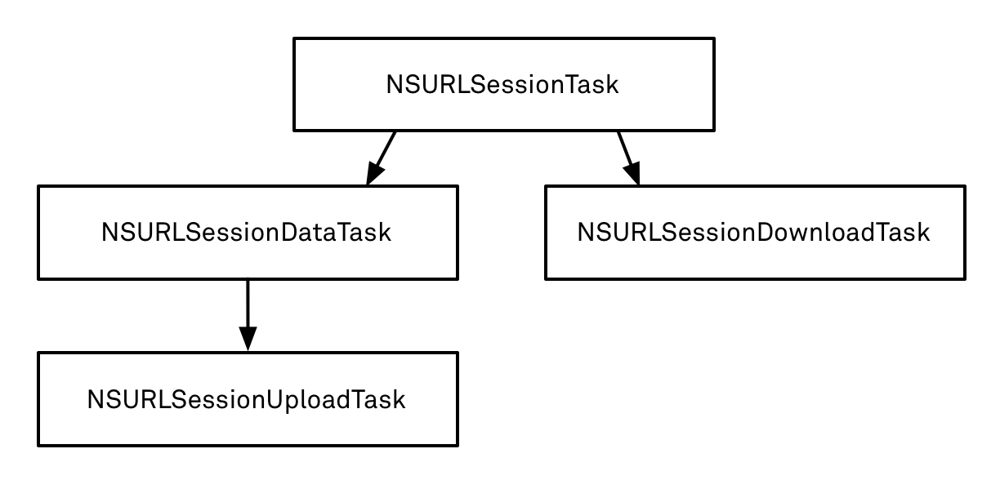

# 8. Работа с сетью

### Noveo University — iOS


----

## Сегодня

* Формат JSON
* RESTful API
* Загрузка в NSData
* NSURLSession
* AFNetworking


----

## JSON
**JSON** (JavaScript Object Notation) — простой формат обмена данными, удобный для чтения и написания как человеком, так и компьютером.
* Используется большей частью современных сетевых API
* Лаконичнее чем XML
* Однозначнее чем XML (легко транслируется в термины стандартных коллекций)
* Поддерживается стандартной библиотекой iOS SDK
* Удобнее парсить


----

## JSON терминология
Имеет всего три базовых понятия:
* Словарь (коллекция пар ключ/значение, ассоциативный массив, объект)
* Массив (упорядоченный список значений, вектор)
* Значение одного из типов:
  - строка (в кавычках, экранирующий символ — обратный слэш)
  - целое число
  - число с плавающей точкой
  - булево значение (true/false)
  - null
  - словарь (пары "ключ":значение через запятую в фигурных скобках)
  - массив (значения через запятую в квадратных скобках)

Последние два типа поддерживают вложенность.


----

## JSON пример
```ObjectiveC
{
   "firstName": "Иван",
   "lastName": "Иванов",
   "weight": 77.8,
   "address": {
       "streetAddress": "Московское ш., 101, кв.101",
       "city": "Ленинград",
       "postalCode": 101101
   },
   "phoneNumbers": [
       "812 123-1234",
       "916 123-4567"
   ],
   "car" : null
}
```


----

## NSJSONSerialization
```ObjectiveC
NSError *error = nil;

NSDictionary *dict =
    [NSJSONSerialization JSONObjectWithData:data options:0 error:&error];
    
if (error != nil) {
    // Обработка ошибки
    //...
}
else {
    // Работа с полученной структурой данных
    //...
}
```


----

## RESTful API
REST (representational state transfer) — это стиль архитектуры API. Идея - придать различную смысловую нагрузку HTTP-запросам.
#### Запросы могут быть:
* GET
* POST
* PUT
* PATCH
* DELETE
* ...


----

## REST примеры
* Скачать пользователей
```
curl -X GET 'https://mws.com/users' 
```
* Добавить пользователя
```
curl -X POST -d '{"name" : "Kolyan"}' 'https://mws.com/users'
```
* Изменить имя пользователя с персональным id = 251
```
curl -X PATCH -d '{"name" : "Nikolay"}' 'https://mws.com/users/251'
```
* Скачать список подписчиков Николая
```
curl -X GET 'https://mws.com/users/251/followers'
```


----

## Работа с сетью в iOS

* Ошибки при работе с сетью — штатная ситуация
* Сеть может быть медленная
* Сети может вообще не быть
* Загрузка данных может стоить пользователю денег :)


----

## Как жить:
* Проверяем доступность сервера
* Обрабатываем возможные ошибки сети
* Обрабатываем возможные ошибки в формате данных
* Ограничиваем количество одновременных запросов
* Один большой запрос быстрее, чем много маленьких
* Никогда не работаем с сетью в главном потоке
* Уважаем пользователя: кэшируем что можно, экономим трафик, показываем спиннер


----

## Загрузка в NSData
```ObjectiveC
NSURL *url = [NSURL URLWithString:@"http://server.org/some/path"];
NSData *data = [NSData dataWithContentsOfURL:url];
// Данные загружены, можно использовать
```
* Самый простой способ загрузить данные из сети (в одну строку)
* Сам по себе способ синхронный (блокирует текущий поток)
* Практически не применим в реальной работе:
  - Слабая обработка ошибок
  - Только HTTP GET
  - Нет управления заголовками
  - Нет докачки
  - …


----

## Загрузка в NSData
```objectiveC
dispatch_async(dispatch_get_global_queue(DISPATCH_QUEUE_PRIORITY_DEFAULT, 0), ^{
    NSURL *url = [NSURL URLWithString:@"http://server.org/some/path"];
    NSData *data = [NSData dataWithContentsOfURL:url];
    // Данные загружены, можно использовать
});
// Здесь данные ещё не загружены! (хотя кто знает... :)
```


----

## NSURLRequest, NSURLSession
* Есть обработка ошибок и кодов ответа
* Можно делать запросы с любым методом (GET/POST/PUT/DELETE/...)
* Поддержка редиректов, авторизации, управление кешированием и т.д.
* Можно управлять заголовками запроса
* Можно организовать докачку/паузу загрузки
* Загрузка/отправка данных в background-режиме.
* ...и прочее
* Применимо на практике, но…
  - Много кода
  - Желательно выделить всю низкоуровневую работу в переиспользуемый компонент


----

## NSURLRequest, NSURLSession
* Создаём и конфигурируем NSURLSession
* Создаём и конфигурируем NSURLRequest
* Сессия создаёт NSURLSessionTask для request-а
* Если нужно, задаём делегата для сессии/задачи
* [task resume]



----

## NSURLSession пример
```ObjectiveC
@property (nonatomic) NSURLSession *URLsession;
//...
- (instancetype)init {
//...
    NSURLSessionConfiguration *sessionConfig =
        [NSURLSessionConfiguration defaultSessionConfiguration];
    sessionConfig.allowsCellularAccess = NO; // wifi only

    _URLsession = [NSURLSession sessionWithConfiguration:sessionConfig
        delegate:self delegateQueue:nil];
//...
}

- (void)downloadFunnyPuppies:(void(^)(NSArray<Puppy *> *))completion

    NSURL *puppiesURL = [NSURL URLWithString:
        @"https://mysupersite.com/v1.2/images/puppies"];

    NSMutableURLRequest *puppiesRequest = 
        [NSMutableURLRequest requestWithURL:puppiesURL];
    [puppiesRequest setValue:@"fr" forHTTPHeaderField:@"Accept-Language"];  
//    [puppiesRequest setHTTPBody:httpBodyForParamsDictionary(@{})];

    NSURLSessionDataTask *task = [self.URLsession dataTaskWithRequest:puppiesRequest
        completionHandler:^(NSData *data, NSURLResponse *response, NSError *error) {

            NSDictionary *responseDict =[NSJSONSerialization JSONObjectWithData:data 
                options:0 error:&jsonError];
            //... Error handling

            completion([self parsePuppies:responseDict]);
    }];

    [task resume];
}
```


----

## AFNetworking
Популярная библиотека для работы с сетью под iOS и MacOS.
* Высокоуровневое API (абстракции для запросов, очередей, типов данных, кэша и т.д.)
* Модульная архитектура (сессии, reachability, JSON, security, загрузка картинок и т.д.)
* Относительно немного кода для решения простых задач
* Поддержка решения сложных задач (AFIncrementalStore и т.д.)


----


## AFNetworking: запрос JSON
```ObjectiveC
#import <AFNetworking.h>
//...
@property (nonatomic, strong) AFHTTPSessionManager *sessionManager;
//...  
- (instancetype)initWithBaseURL:(NSURL *)baseURL {
    //...
    NSURL *baseURL = [NSURL URLWithString:@"https://mysupersite.com/v1.2"];
    _sessionManager = [[AFHTTPSessionManager alloc] initWithBaseURL:baseURL];
    [_sessionManager.requestSerializer setValue:@"fr" 
        forHTTPHeaderField:@"Accept-Language"];
    //...
}
 
- (void)downloadFunnyKittens:(void(^)(NSArray<Kitten *> *))completion
{
    [self.sessionManager GET:@"/images/kittens" parameters:@{}
        success:^(NSURLSessionDataTask *task, NSDictionary *responseDict) {
            NSArray *kittens = [self parseKittens:responseDict];
            if (completion) {
                completion(kittens);
            }
        }
        failure:^(NSURLSessionDataTask *task, NSError *error) {
            //обработка ошибки
    }];
}
```


----

## AFNetworking проверка сети
```ObjectiveC
AFNetworkReachabilityManager *rm = [AFNetworkReachabilityManager sharedManager];
//[AFNetworkReachabilityManager managerForDomain:@"google.com"];
[rm setReachabilityStatusChangeBlock:^(AFNetworkReachabilityStatus status) {
    if (status == AFNetworkReachabilityStatusNotReachable) {
        //доступа к сети пропал
    }
    else {
        //доступ к сети появился
    }
}];
[rm startMonitoring];

if ([rm isReachable]) {
    //доступ есть
}
```


----

## AFNetworking плюшки

* Спинер в статусе
    ```ObjectiveC
    [AFNetworkActivityIndicatorManager sharedManager].enabled = YES;
    ```
* Кеширование картирок (правда, SDWebImage получше)
    ```ObjectiveC
    - (void)setImageWithURL:(NSURL *)url 
        placeholderImage:(nullable UIImage *)placeholderImage;
    ```
* Прогресс-бары
    ```ObjectiveC
    [self.progressView setProgressWithDownloadProgressOfTask:downloadTask animated:YES];
    ```


----