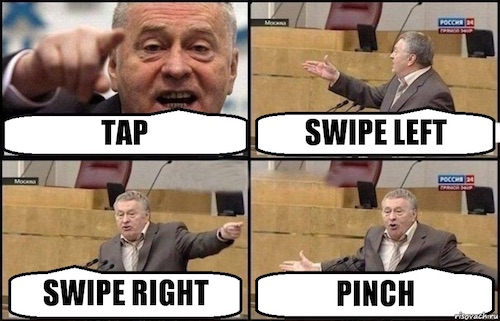

# 10. Обработка событий

### Noveo University — iOS

#### Александр Горбунов


----

## Сегодня

* `UIResponder`, `UIEvent`
* `UITouch`
* `UIGestureRecognizer`
* акселерометр, гироскоп
* локальные нотификации


----

## UIResponder

`UIResponder` — "абстрактный" класс (родитель `UIViewController`, `UIView`, `UIApplication`), содержащий методы обработки событий (от клавиатуры, касаний, акселерометра, кнопок гарнитуры) и управляющий клавиатурой.


----

## UIResponder

Уже знакомый пример использования `UIResponder` — показ и скрытие клавиатуры:

```ObjectiveC
// Показать клавиатуру
[self.textField becomeFirstResponder];

// Скрыть клавиатуру
[self.textField resignFirstResponder];
```


----

## UIEvent

`UIEvent` — класс для описания следующих типов событий:
* Touch events (касания)
* Motion events (акселерометр, гироскоп, тряска)
* Remote-control events (кнопки гарнитуры: пауза, перемотка, ...)

События `UIEvent` приходят в объекты-респондеры (наследники класса `UIResponder`): `UIViewController`, `UIView`, `UIApplication`, `UIWindow` и их наследники.


----

## UITouch

`UITouch` — класс, представляющий касание.

* Каждый `UITouch` соответствует одному касанию (пальцу).
* Объект `UITouch` живёт на протяжении всего жеста, при этом меняются его координаты и timestamp.
* У `UITouch` можно спросить нынешние и предыдущие координаты относительно любого view или window.
* `UITouch` хранит информацию о view, на которой начался жест и о количестве тапов в начале жеста.
* Чтобы view отвечала на касания, нужно выставить свойство `userInteractionEnabled = YES`.
* Один `UIEvent` типа `UIEventTypeTouches` содержит множество объектов `UITouch`.


----

## UITouch

Для обработки касаний во View или ViewController нужно реализовать следующие методы `UIResponder`:

* `touchesBegan:withEvent:`  
  Вызывается один раз при старте жеста.
* `touchesMoved:withEvent:`  
  Вызывается постоянно во время движения пальца.
* `touchesEnded:withEvent:`  
  Вызывается один раз при окончании жеста.
* `touchesCancelled:withEvent:`  
Вызывается при отмене жеста (например если телефон поднесли к уху).


----

## UIGestureRecognizer

`UIGestureRecognizer` — "абстрактный" класс, предоставляющий интерфейс для работы с жестами на более высоком уровне абстракции по сравнению с касаниями. Может оперировать такими понятиями как скорость перемещения, направление свайпа, уровень зума, угол поворота, длительность нажатия.




----

## UIGestureRecognizer

Конкретные реализации включают:
* `UITapGestureRecognizer`
* `UISwipeGestureRecognizer`
* `UIPanGestureRecognizer`
* `UIPinchGestureRecognizer`
* `UIRotationGestureRecognizer`
* `UIScreenEdgePanGestureRecognizer`
* `UILongPressGestureRecognizer`


----

## UIGestureRecognizer

* Объект конкретного класса `UIGestureRecognizer` добавляется на `UIView` и отслеживает события на этой view.
* Рекогнайзеру задаётся пара target/action, в которую передаётся управление после совершения пользователем соответствующего жеста.
* Рекогнайзер может иметь делегата, ответственного за разрешение конфликтов между несколькими рекогнайзерами на одной view.


----

## UIGestureRecognizer

```ObjectiveC
@property (nonatomic) UIView *chip;
```

```ObjectiveC
- (void)viewDidLoad
{
	...
	
	UIRotationGestureRecognizer *gr = [[UIRotationGestureRecognizer alloc]
		initWithTarget:self action:@selector(rotate:)];
	
	[self.chip addGestureRecognizer:gr];
}
 
- (void)rotate:(UIRotationGestureRecognizer *)gr
{
	self.chip.transform = CGAffineTransformMakeRotation(gr.rotation);
}
```


----

## Motion-события

`UIViewController` является наследником `UIResponder` и может получать события:

```ObjectiveC
- (void)motionEnded:(UIEventSubtype)motion withEvent:(UIEvent *)event
{
	[super motionEnded:motion withEvent:event];

	if (motion == UIEventSubtypeMotionShake) {
		// Реакция на тряску
		...
	}
}
 
- (BOOL)canBecomeFirstResponder
{
	return YES;
}
 
- (void)viewDidLoad
{
	...
	[self becomeFirstResponder];
}
```


----

## Core Motion

```ObjectiveC
@import CoreMotion;
```

```ObjectiveC
@property (strong, nonatomic) CMMotionManager *cmManager;
```

```ObjectiveC
self.cmManager = [[CMMotionManager alloc] init];
[self.cmManager startDeviceMotionUpdatesToQueue:[NSOperationQueue mainQueue]
	withHandler:^(CMDeviceMotion *motion, NSError *error) {
		// Динамика вращений: motion.rotationRate
		// Динамика ускорений: motion.userAcceleration
		// Текущая ориентация: motion.gravity
	}];
```


----

## UILocalNotification

Локальные нотификации позволяют показывать всплывающее сообщение в заранее определённое время, не полагаясь на состояние приложение в этот момент. Пользователю будет предложено проигнорировать сообщение или запустить наше приложение.

```ObjectiveC
UILocalNotification *notification = [[UILocalNotification alloc] init];
notification.fireDate  = [[NSDate date] dateByAddingTimeInterval:60.0];
notification.alertAction = @"Show...";
notification.alertBody = @"Some text message for user...";
notification.soundName = UILocalNotificationDefaultSoundName;
[[UIApplication sharedApplication] scheduleLocalNotification:notification];
```


----

## UILocalNotification

В AppDelegate мы получаем нотификации:

```ObjectiveC
- (BOOL)application:(UIApplication *)application
	didFinishLaunchingWithOptions:(NSDictionary *)launchOptions
{
	UILocalNotification *ln =
		launchOptions[UIApplicationLaunchOptionsLocalNotificationKey];

	if (ln) {
		// Приложение запущено из нотификации.
		...
	}
	
	return YES;
}
 
- (void)application:(UIApplication*)application
	didReceiveLocalNotification:(UILocalNotification*)n
{
	// Нотификация получена во время работы приложения.
	...
}
```
