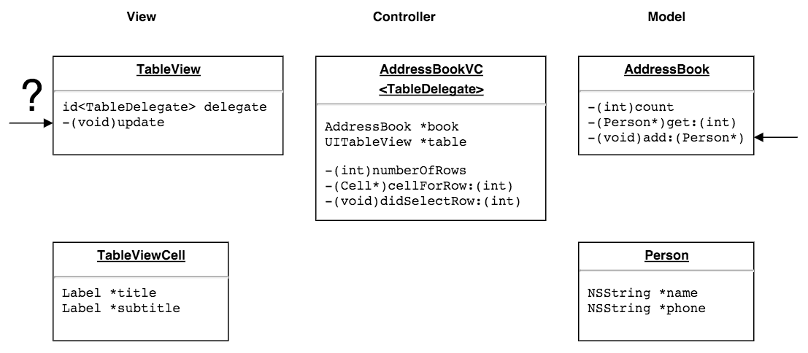
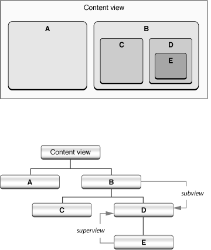

# 1.2 Основы паттернов ООП

### Noveo University — iOS

#### Александр Горбунов


----

## Сегодня

* MVC
* Delegate
* Observer
* Singleton

... красивые названия для обыденных вещей
<!-- .element: class="fragment" -->


----

## Model-View-Controller

### View
* то, что видит пользователь
* переиспользуется для  разных данных


----

## Model-View-Controller

### View

```
UIView
UILabel
UITextField
UIButton
UISwitch
UIToolbar
UITableView
UIImageView
...
```


----

## Model-View-Controller

### Controller
* соединяет объекты-модели с объектами-видами
* бизнес-логика
* управляет жизненным циклом приложения
* обрабатывает действия пользователя


----

## Model-View-Controller

### Controller

```
UIApplicationDelegate
UIViewController
UINavigationController
UITabBarController
...
```


----

## Model-View-Controller

### Model
* хранение данных
* бизнес-логика
* может иметь разные представления
* может "общаться" с другой моделью


----

## Model-View-Controller

### Model

```
кастомные классы с данными
...
NSArray
NSDictionary
NSString
...
NSURLConnection
CLLocationManager
...
```

`NSURLConnection`, `CLLocationManager` — для клиентского кода это модель. Сами для себя эти классы — система, имеющая свою модель и контроллер на более низком уровне абстракции.


----

## Model-View-Controller


----

## Model-View-Controller


----

## Model-View-Controller


----

## Delegate


----

## Delegate




----

## Observer


----

## Singleton

Порождающий шаблон проектирования, гарантирующий что в приложении будет единственный экземпляр класса с глобальной точкой доступа.

Пример обращения к одиночке:
```
MyClass *instance = [MyClass sharedInstance];
```


----

## Singleton

- \+ Клиентам не нужно заботиться об инициализации объект
- \+ Объект легко доступен всем

<!-- .element: style="list-style-type:none"-->

- – Связи в коде становятся неявными
- – Затруднено масштабирование проекта (например переход от однопользовательской модели к многопользовательской)
- – Затруднено переиспользование отдельных модулей
- – Затруднена изоляция модулей (например для unit-тестирования)

<!-- .element: style="list-style-type:none"-->
<!-- .element: class="fragment"-->


----

## Singleton

Типичная реализация:

```ObjectiveC
// Singleton.h
@interface Singleton : NSObject
+ (Singleton *)sharedInstance;
@end
```

```ObjectiveC
// Singleton.m
@implementation Singleton
+ (Singleton *)sharedInstance
{
	static Singleton *_sharedInstance = nil;
	@synchronized(self) {
		if (!_sharedInstance) {
			_sharedInstance = [[Singleton alloc] init];
		}
	}
	
	return _sharedInstance;
}
@end
```


----

## Singleton

* Показанная реализация не является наилучшей, но хорошо отражает идею.
* В строгом смысле код в примере реализует не одиночку, а Shared Instance.

Примеры Shared Instance из стандартной библиотеки:

* `[NSUserDefaults standardUserDefaults]`
* `[UIApplication sharedApplication]`
* `[UIScreen mainScreen]`


----

## Composite

Компоновщик — структурный шаблон проектирования, организующий объекты в древовидную структуру. Компоновщик позволяет клиентам однотипно общаться с разнотипными элементами дерева.

Паттерн определяет общий интерфейс объектов, которые в свою очередь могут состоять из примитивных или других составных объектов.

```ObjectiveC
@protocol Composite
@property (readonly) NSArray <id<Composite>> *children;
- (void)addChild:(id<Composite>)child;
- (void)removeChild:(id<Composite>)child;
@end
```


----

## Composite

Иерархия UIView — типичный пример компоновщика.




----

## Рекомендуемая литература

Классическая книга по шаблонам от "Банды Четырёх"

