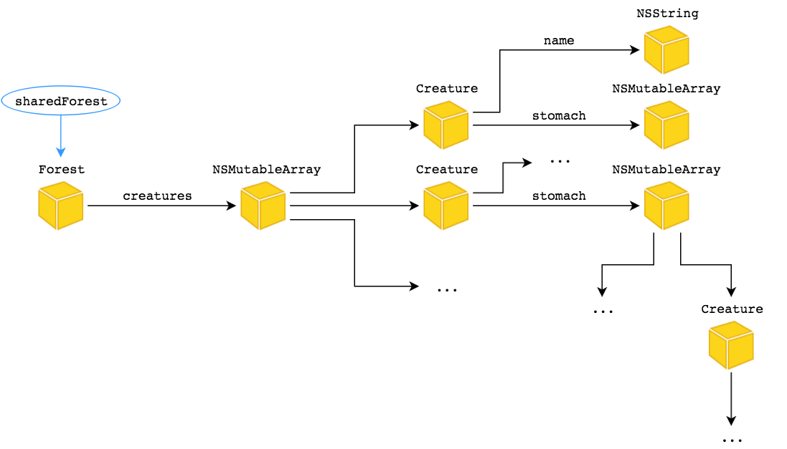
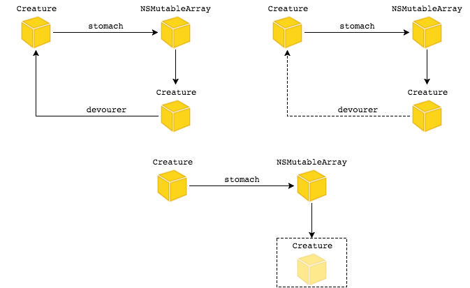
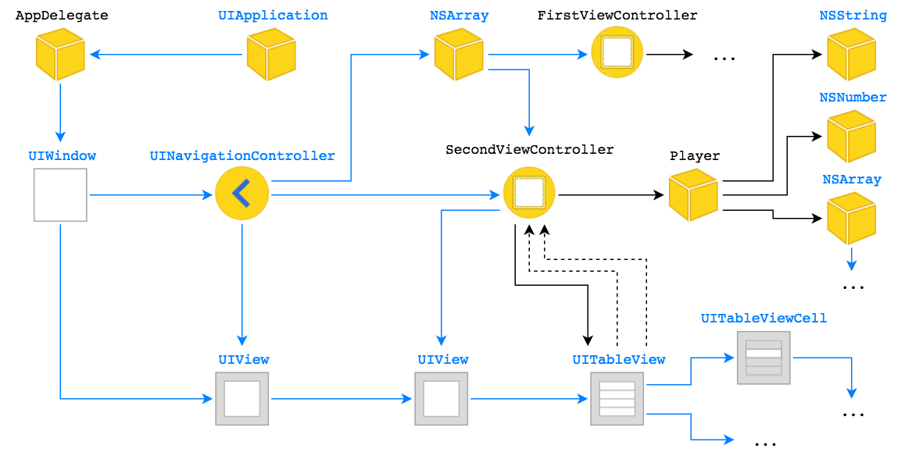

# 3 Управление памятью

### Noveo University — iOS

#### Дмитрий Горев


----

## Сегодня

* Основы управления памятью
* Manual Retain-Release
* Automatic Reference Counting


----

## Типы памяти

* __Статическая память__ содержит глобальные и статические скалярные переменные и ссылки на объекты
* __Локальная (стековая) память__ выделяется при входе в подпрограмму (метод, функцию) и освобождается при выходе из нее
* __Динамическая память__ выделяется в рантайме и управляется кодом


----

## Управление динамической памятью

* Динамическое выделение памяти
* Использование выделенной памяти
* Высвобождение выделенной памяти


----

## Виды управления памятью

* Ручное управление
  * new, calloc, malloc, delete, free
  * Smart pointers (Boost / STL)
  * Manual Retain-Release (MRR)
* Автоматическое управление
  * Garbage collection (GC)
  * Automatic Reference Counting (ARC)


----
<!--
## Проблемы ручного управления памятью

* Освобождение (перезапись) данных, которые все еще используются
* Исполнение программы без освобождения памяти, занятой более ненужными данными


---->

## Эффективное управление памятью

Использование номинально необходимого объема выделяемой памяти, достигается за счет:
* Выделения памяти по необходимости
* Совместного использования данных
* Своевременного удаления ненужных объектов (данных)


----

# Manual Retain-Release


----

## Основные положения

* Управление памятью объектов базируется на объектом "владении" (ownership)
* К управлению связями между объектами следует подходить с позиции "объектных графов"
* Объект живет пока имеет одного или нескольких владельцев
* Объект умирает когда больше не имеет владельцев


----

## Объектный граф




----

## Основные положения

* Вы владеете любым объектом, который создаете (методами `alloc`, `new`, `copy`, `mutableCopy`)
* Вы можете стать владельцем объекта (сохранив его от преждевременного уничтожения), вызвав его метод `retain`
* Когда объект вам больше не нужен, вы отпускаете его методом `release` или `autorelease`
* Вы не должны отказываться от владения объектом если вы его не создавали
* Вы не владеете объектами, возвращенными по ссылке


----

## Кто такие "вы"?

* Подпрограмма
  * Метод объекта
  * Метод класса
  * Функция
* Объект
  * ivar


----

## Под капотом

* Выделение памяти под объект (и его переменные) происходит в методе класса `alloc`
* Высвобождение памяти и ресурсов происходит в методе объекта `dealloc`
* Каждый объект имеет свойство-счетчик ссылок (счетчик владельцев) `retainCount`
* Объект умирает (вызывается метод `dealloc`) когда счетчик ссылок достигает нуля


----

## Управление счетчиком ссылок

* Методы `alloc`, `new`, `copy`, `mutableCopy` возвращают объекты с счетчиком ссылок равным единице*
* Метод `retain` увеличивает счетчик на единицу
* Метод `release` уменьшает счетчик на единицу
* Метод `autorelease` выполняет отложенное уменьшение счетчика на единицу

\*На самом деле не всегда, но мы должны так считать


----

## Пример

```ObjectiveC
NSMutableArray *array = [[NSMutableArray alloc] init];
NSLog(@"%ld", array.retainCount); //1
[array retain]; //2
[array retain]; //3
[array release]; //2
[array autorelease]; //2

NSMutableArray *arrayCopy = [array mutableCopy]; //1
[arrayCopy release]; //0
[arrayCopy release]; //Exception - zombie
```


----

## Владение объектами в пределах подпрограммы

* Создаем объекты когда они нужны
* Освобождаем когда они больше не нужны
* Отложенно освобождаем для возвращения "наверх"


----

## Пример

```ObjectiveC
- (NSString *)getTimeOfDate:(NSDate *)date
{
    NSDateFormatter *dateFormatter = [[NSDateFormatter alloc] init];
    dateFormatter.date = @"hh:mm";
    NSString *dateString = [dateFormat stringFromDate:date];
    [dateFormat release];

    return dateString;
}
```
Упрощенный вариант
```ObjectiveC
- (NSString *)getTimeOfDate:(NSDate *)date
{
    NSDateFormatter *dateFormatter = [[[NSDateFormatter alloc] init] autorelease];
    dateFormatter.date = @"hh:mm";
    return [dateFormat stringFromDate:date];
}
```


----

## Пример

```ObjectiveC
NSString *appendNewLineToString(NSString *string)
{
    NSString *result = [[NSString alloc] initWithFormat:@"%@\n", string];
    [result autorelease];
    return result;
}
```
Упрощенный вариант
```ObjectiveC
NSString *appendNewLineToString(NSString *string)
{
    return [[[NSString alloc] initWithFormat:@"%@\n", string] autorelease];
}
```
Еще проще
```ObjectiveC
NSString *appendNewLineToString(NSString *string)
{
    return [NSString stringWithFormat:@"%@\n", string];
}
```


----

## Пример

```ObjectiveC
NSError *error = nil;
NSString *string =
    [[NSString alloc]
        initWithContentsOfFile:fileName encoding:NSUTF8StringEncoding error:&error];
if (error) {
    //error processing
}
//...
[string release];
```


----

## Управление памятью в пределах объекта

Для грамотного владения объектом нужно:
* Создать объект либо завладеть объектом, полченным извне
* Сохранить ссылку на объект в переменной объекта-владыки
* Освободить объект и занулить ссылку когда он больше не нужен


----

## Пример

```ObjectiveC
@interface Person : NSObject {
    NSString *_lastName;
}
@end

@implementation Person

- (void)setLastName:(NSString *)lastName
{
    [lastName retain];
    [_lastName release];
    _lastName = lastName;
}

- (NSString *)getLastName
{
    return _lastName
}

@end
```


----

## То же самое

```ObjectiveC
@interface Person : NSObject {
    NSString *_lastName;
}
@property (retain) NSString *lastName;
@end

@implementation Person
@synthesize lastName = _lastName;
@end
```
Еще проще (c XCode 4.4)
```ObjectiveC
@interface Person : NSObject
@property (retain) NSString *lastName;
@end

@implementation Person
@end
```


----

## Пример

```ObjectiveC
@interface Person : NSObject
@property (retain) NSString *firstName;
@property (retain) NSString *lastName;
@end

@implementation Person

- (void)setNewFirstName:(NSString *)firstName lastName:(NSString *)lastName
{
    self.firstName = firstName;
    self.lastName = lastName;
}

@end
```


----

## dealloc

* Вызывается системой когда объект умирает (больше не имеет владельцев)
* Вручную нельзя вызывать
* Служит для освобождения всех объектов-рабов и ресурсов
* Где-то в `[NSObject dealloc]` (или рядом) происходит низкоуровневое высвобождение памяти, отведенной под объект и его переменные
* Реализация метода должна высвободить внутренние объекты (по ссылкам-переменным, объявленным в классе), и вызвать `[super dealloc]`
* Не стоит использовать сеттеры и геттеры
* Нельзя помещать код, управляющий системными ресурсами


----

## Пример

```ObjectiveC
@interface ExtendedPerson : Person
@property (retain) NSNumber *age;
@property (retain) NSDate *birthDate;
@end

@implementation ExtendedPerson

- (void)dealloc
{
    [_age release];
    _age = nil;
    [_birthDate release];
    _birthDate = nil;
    [super dealloc];
}

@end
```


----

## Типичные ошибки

* Неуравновешенное колчество вызовов методов создания+владения и освобождения
  * Обращением к мертвым объектам - зомби
  * Бессмертные объекты (и их подчиненные) - утечки памяти
* Циклические неуправляемые сильные связи


----

## Классификаторы времени жизни

К свойствам объектов применимы следующие классификаторы
* `assign` (по умолчанию для объектов, единственный вариант для скалярных типов)
* `retain`
* `copy`

А также
* `readwrite`
* `readonly`


----

## Пример

```ObjectiveC
- (void)setRetainString:(NSString *)string
{
    [_retainString release];
    _retainString = [string retain];
}

- (void)setCopyString:(NSString *)string
{
    [_copyString release];
    _copyString = [string copy];
}

- (void)setAssignString:(NSString *)string
{
    _assignString = string;
}
```


----

## "Слабое" связывание объектов

* Классификатор `assign`
* Решает проблему циклических ссылок
* Не оказывает влияния на счетчик ссылок


----

## Пример




----

## Граф объектов приложения




----

# Autorelease Pools


----

## Autorelease pools

* Механизм, предоставляющий возможность отказаться от прав владения объектом, избегая немедленного высвобождения памяти
* Все объекты, получившие сообщение `autorelease`, остаются в памяти до тех пор, пока жив pool, в котором объект получил это сообщение


----

## Autorelease pools

Обычно вам не нужно создавать подобного рода объекты, за исключением нескольких особых случаев
* Приложение, которое не базируется на UI framework
* Цикл, порождающий множество временных объектов
* Многопоточное приложение: каждый новый поток должен иметь собственный `autorelease pool` к моменту запуска.


----

## Принцип действия

* `Autorelease pool` Запоминает объекты, которым был послан `autorelease`
* При уничтожении рассылает сообщение `release` всем своим объектам
* Число рассылаемых сообщений `release` равно числу разосланных `autorelease`


----

## Пример

```ObjectiveC
{
    NSAutoreleasePool *pool =
        [[NSAutoreleasePool alloc] init];

    // Code that creates autoreleased objects.

    [pool release];
}
```


----

# Automatic Reference Counting


----

## Переход на ARC

* Концептуально ARC идентичен MRR
* В отличии от MRR, подсчет ссылок осуществляется автоматически
* Все необходимые для управления памятью вызовы расставляются за вас на этапе компиляции


----

## Преимущества ARC

* Лишен недостатков, присущих ручным способам управления памятью
* Уменьшает объем кода
* Уменьшает время разработки
* Нарушение установленных правил управления памятью приводит к ошибке компиляции


----

## Когда использовать ARC?

“You are strongly encouraged to use ARC for new projects.”

Copyright © 2012 Apple Inc. All Rights Reserved.


----

## Ограничения ARC

Запрещено вызывать:
* `retain`
* `release` (`autorelease`)
* `[super dealloc]`


----

## Классификаторы времени жизни

* `strong` ( = `retain`, по умолчанию для объектов)
* `weak`
* `unsafe_unretained` ( = `assign`)


----

## Классификаторы времени жизни

К переменным применимы следующие классификаторы:
* __strong (по умолчанию для объектов)
* __weak
* __unsafe_unretained
* __autoreleasing


----

## Классификаторы времени жизни

Оформляйте классификаторы правильно!

`ClassName *qualifier variable;`


----

## Пример

```ObjectiveC
MyClass *__weak weakReference = ...;

MyClass *__unsafe_unretained unsafeReference = ...;
```


----

## Включение/выключение ARC

При помощи флагов компилятора
* -fobjc-arc
* -fno-objc-arc


----

# Autorelease Pool Blocks


----

## Autorelease Pool Blocks

* Концептуально блоки ничем не отличаются от объектов,
* Отличие состоит только в синтаксической записи.


----

## Пример

```ObjectiveC
{
    @autoreleasepool {
        // Code that creates autoreleased objects.
    }
    ...
}

```


----

## Диагностика управления памятью

* Clang Static Analyzer
* Developer Tools - Instruments


----

## Темы для самостоятельного изучения

[Особенности управления памятью в Core Foundation с использованием ARC](https://developer.apple.com/library/ios/releasenotes/ObjectiveC/RN-TransitioningToARC/Introduction/Introduction.html#//apple_ref/doc/uid/TP40011226-CH1-SW1)


----

## Справочная литература

[Advanced Memory Management Programming Guide](https://developer.apple.com/library/mac/documentation/Cocoa/Conceptual/MemoryMgmt/Articles/MemoryMgmt.html#//apple_ref/doc/uid/10000011-SW1)

[Transitioning to ARC Release Notes](https://developer.apple.com/library/ios/releasenotes/ObjectiveC/RN-TransitioningToARC/Introduction/Introduction.html#//apple_ref/doc/uid/TP40011226-CH1-SW11)

[Toll-Free Bridged Types](https://developer.apple.com/library/ios/documentation/CoreFoundation/Conceptual/CFDesignConcepts/Articles/tollFreeBridgedTypes.html#//apple_ref/doc/uid/TP40010677)

[ARC Best Practices](http://amattn.com/p/arc_best_practices.html)

