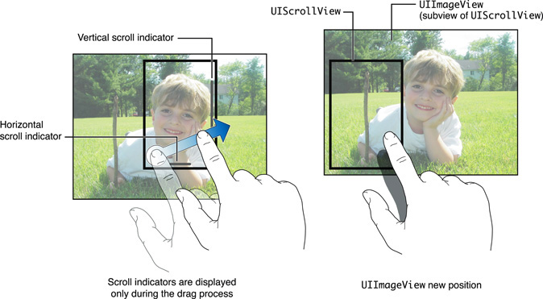
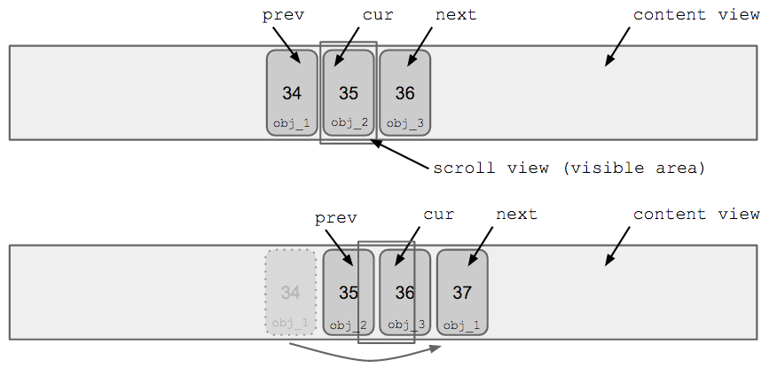

# 5.2. UIKit framework

### Noveo University — iOS


----

## Сегодня

* `UIView` subclassing
* `CALayer`
* Трансформации
* Анимации
* `UIScrollView`
* `UITableView`
* `UICollectionView`


----

## UIView subclassing

* `- (id)initWithFrame:(CGRect)frame` — designated initializer
* `- (id)initWithCoder:(NSCoder *)aCoder` — designated initializer при создании объекта view из XIB/Storyboard
* `- (void)layoutSubviews` — определяет расположение вложенных view
* `- (void)updateConstraints` — определяет расположение вложенных view
* `- (void)drawRect:(CGRect)rect` — выполняет отрисовку полностью кастомной view
* `- (CGSize)sizeThatFits:(CGSize)size` — предпочтительный размер
* `- (CGSize)intrinsicContentSize` — предпочтительный размер


----

## UIView animation

Свойства `UIView`, которые можно анимировать:
* `CGRect frame`
* `CGRect bounds`
* `CGPoint center`
* `CGAffineTransform transform`
* `CGFloat alpha`
* `UIColor backgroundColor`
* ~~`CGRect contentStretch`~~


----

## UIView animation

Анимированно скрываем кнопку после нажатия:

```ObjectiveC
- (IBAction)settingsButtonTap:(UIButton *)sender
{
	[UIView animateWithDuration:0.3 animations:^{
			sender.alpha = 0;
		} completion:^(BOOL finished) {
			sender.hidden = YES;
			sender.userInteractionEnabled = NO;
		}];
}
```


----

## UIView animation

Анимированный поворот:

```ObjectiveC
[UIView animateWithDuration:2 animations:^{
		view.transform = CGAffineTransformRotate(view.transform, M_PI / 3.0);
	}];
```


----

## UIView animation

При использовании автолейаутов можно анимировать константу констрейнта.

```ObjectiveC
self.buttonBottom.constant = 40.0f;
[self.view setNeedsUpdateConstraints];

[UIView animateWithDuration:0.25f animations:^{
	   [self.view layoutIfNeeded];
	}];
```


----

## CALayer

`CALayer` содержится в каждой `UIView`, отвечает за её отрисовку.

Как и с `UIView`, мы можем строить дерево вложенных `CALayer`.

Одна view может содержать несколько слоёв.


----

## CALayer

`CALayer` можно использовать для простенькой кастомизации view: тень, рамка, закруглённые края, градиент.

* `CGPoint anchorPoint`
* `CGColorRef borderColor`
* `CGFloat borderWidth`
* `CGFloat cornerRadius`
* `BOOL masksToBounds`
* `CGColorRef shadowColor`
* `CGSize shadowOffset`
* `float shadowOpacity`
* `CATransform3D transform`


----

## CALayer

`CALayer` можно использовать для простенькой кастомизации view: тень, рамка, закруглённые края, градиент.

В реальности лучше использовать картинки и маски, т.к. это даёт больше гибкости и работает ощутимо быстрее.


----

## CALayer

```ObjectiveC
self.textLabel = [[UILabel alloc] initWithFrame:self.view.bounds];
self.textLabel.layer.shadowColor = [UIColor whiteColor].CGColor;
self.textLabel.layer.shadowRadius = 12;
self.textLabel.layer.shadowOpacity = 1;
self.textLabel.layer.masksToBounds = NO;
	
self.button = [[UIButton alloc] initWithFrame:(CGRect){20, 20, 100, 40}];
self.button.backgroundColor = [UIColor brownColor];
self.button.layer.masksToBounds = YES;
self.button.layer.cornerRadius = 8;
self.button.layer.borderWidth = 2;
self.button.layer.borderColor = [UIColor blackColor].CGColor;
```


----

## UIScrollView

* Прокрутка по контенту, который не влезает полностью в область отображения
* Анимированная навигация по областям контента или отдельным экранам (паджинация)
* Масштабирование контента с помощью стандартных жестов


----

## UIScrollView




----

## UIScrollView


```ObjectiveC
@interface ViewController ()
@property (nonatomic) UIImageView *imageView;
@property (nonatomic) UIScrollView *contentScroller;
@end
 
@implementation ViewController
- (void)viewDidLoad
{
	[super viewDidLoad];
	
	self.contentScroller = [[UIScrollView alloc] initWithFrame:self.view.bounds];
	[self.view addSubview:self.contentScroller];
	
	self.imageView = [[UIImageView alloc] initWithImage:self.image];
	[self.contentScroller addSubview:self.imageView];
	
	self.contentScroller.contentSize = self.imageView.frame.size;
}
@end
```


----

## UIScrollView

Без автолейаутов — руками высчитываем и устанавливаем `contentSize`.

С автолейаутами — привязываем контент со всех сторон к ScrollView. При этом `contentSize` высчитывается автоматически и руками не меняется.


----

## UIScrollView

Показ большого (но конечного) количества элементов с навигацией свайпами.




----

## UIScrollView

```ObjectiveC
- (void)viewDidLoad
{
	[super viewDidLoad];
	
	self.contentScroller = [[UIScrollView alloc] initWithFrame:self.view.bounds];
	[self.view addSubview:self.contentScroller];
	self.contentScroller.delegate = self;
}
 
// Вызывается постоянно во время прокрутки,
// наш код должен работать быстро!
- (void)scrollViewDidScroll:(UIScrollView *)scrollView
{
	// Вычисляем номер элемента, центр которого ближе всего
	// Если это не текущий элемент:
	// - делаем видимый элемент центральным
	// - подгружаем новый соседний элемент
	// - исправляем координаты соседних элементов.
}
```


----

## UITableView

* Список однородных элементов (ячейки могут быть разного типа, но основной смысл всё-таки в повторении)
* Стандартная схема для переиспользования объектов
* Реакция на прокрутку, нажатие, свайпы
* Стандартная реализация добавления/удаления/перемещения, включая анимации
* Ячейки таблицы принадлежат классу `UITableViewCell` (или его наследникам)


----

## UITableView

* Таблица запрашивает количество групп и ячеек и сами ячейки у своего DataSource.
* Таблица сообщает о прокрутке, выделении и удалении ячеек своему Delegate.
* Таблица запрашивает размеры ячеек, заголовки и прочие параметры кастомизации у Delegate.


----

## UITableView

В иерархии view находятся только видимые ячейки. Когда ячейка уходит из области видимости, она перемещается в пул переиспользуемых ячеек. Когда нужно показать очередную ячейку, она берётся из буфера. Это позволяет экономит память и повышает скорость работы (поменять данные в имеющемся объекте обычно быстрее, чем создавать новый).

При попадании в буфер ячейка должна отменить долгие асинхронные операции и сбросить своё состояние.


----

## UITableView

Необходимый минимум для работы с таблицей:
* создать объект-таблицу и поместить его на видимую view
* задать DataSource (объект должен отвечать протоколу `UITableViewDataSource`)
* в DataSource переопределить следующие методы:

```ObjectiveC
- (UITableViewCell *)tableView:(UITableView *)tableView
	cellForRowAtIndexPath:(NSIndexPath *)indexPath;
	
- (NSInteger)tableView:(UITableView *)tableView
	numberOfRowsInSection:(NSInteger)section;
```


----

## UITableView

Для обработки нажатия на элемент списка необходимо:
* задать Delegate (объект должен отвечать протоколу UITableViewDelegate)
* в Delegate переопределить метод

```ObjectiveC
- (void)tableView:(UITableView *)tableView
	didSelectRowAtIndexPath:(NSIndexPath *)indexPath;
```


----

## UITableView

```ObjectiveC
#import "MyCell.h"
 
- (void)viewDidLoad
{
	[super viewDidLoad];
	
	// При использовании отдельного XIB для ячейки MyCell:
	[self.tableView registerNib:[MyCell cellNib]
		forCellReuseIdentifier:[MyCell cellIdentifier]];
	
	// При использовании прототипов ячеек в Storyboard
	// регистрация осуществляется автоматически.
}
 
- (UITableViewCell *)tableView:(UITableView *)tableView
	cellForRowAtIndexPath:(NSIndexPath *)indexPath
{
	MyCell *myCell = [tv dequeueReusableCellWithIdentifier:[MyCell cellIdentifier]];
	// Кастомизация myCell.
	return myCell;
}
```


----

## UITableView

* Нельзя поменять высоту ячейки не перезагрузив её.
* При перезагрузке ячейки вы должны отдать *другую* ячейку.
* Эти обстоятельства препятствует добавлению анимированного динамического контента и полей ввода в таблицу.


----

## UITableView

При использовании автолейаутов для ячеек можно автоматизировать вычисление высоты. Размер ячеек не должен отличаться слишком сильно, а заданная оценка высоты должна быть правдоподобной.

```ObjectiveC
self.tableView.estimatedRowHeight = 100.0;
self.tableView.rowHeight = UITableViewAutomaticDimension;
```


----

## UICollectionView

* Двумерная коллекция (однородных) элементов
* Работа с коллекцией очень похожа на `UITableView`
* Мощные средства кастомизации лейаута элементов
* Можно менять лейаут на лету
* Можно менять геометрию ячеек, не перезагружая их


