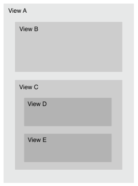
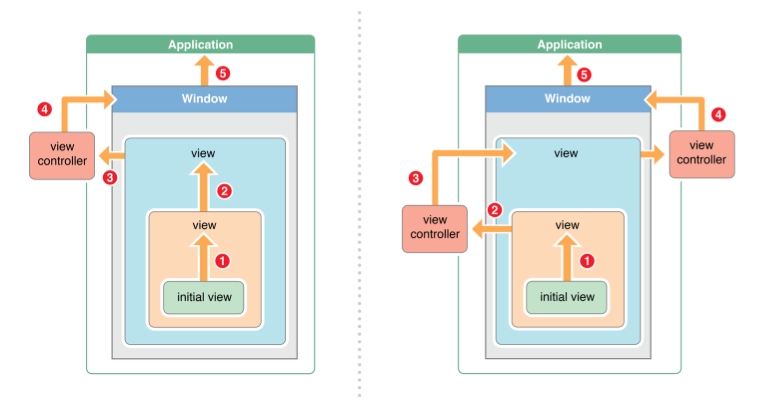
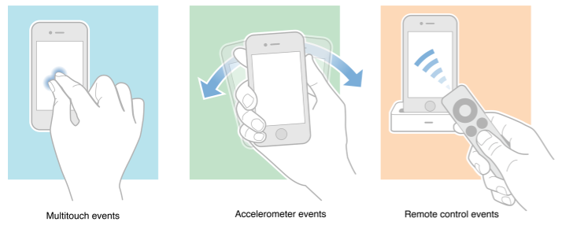

# 10. Обработка событий

### Noveo University — iOS

#### Сивых Михаил


----

## Событие

Событие – абстракция инцидента или сигнала в реальном мире, который сообщает нам о перемещении чего-либо в новое состояние.

Таким образом, под событием можно понимать переход объекта из одного состояния в другое.

Пример:
> * Создание объекта
> * Уничтожение объекта


----

## Что может быть связано с событием?

* Уникальный идентификатор события.
* Значение.
* Модель событий, которая принимает событие - что делать при получении.
* Данные, которые передаются другому объекту.


----

## UIResponder

Данный класс предоставляет интерфейс для объектов, которые обрабатывают или отвечают на события. Является родительским классом для `UIApplication`, `UIView` и их потомков (в том числе `UIWindow`). 


----

## UIView : UIResponder

```ObjectiveC
- (UIView *)hitTest:(CGPoint)point withEvent:(UIEvent *)event;
// Игнорирует все subview, которые 
// 									* скрыты;
// 									* userInteractionEnabled = NO;
// 									* alpha < 0.01.

- (BOOL)pointInside:(CGPoint)point withEvent:(UIEvent *)event;
// Вызывается перед проверкой hittest для конкретного subview
``` 




----

## UIResponder

```ObjectiveC
- (UIResponder *)nextResponder; // default: nil
```



----

## UIResponder

```ObjectiveC
- (BOOL)canBecomeFirstResponder; // default: NO
- (BOOL)becomeFirstResponder;
- (BOOL)canResignFirstResponder; // default: YES
- (BOOL)resignFirstResponder;
- (BOOL)isFirstResponder;
```

<!-- Рассказать о...
UIViewController.view.nextResponder ~> UIViewController
UIViewController.nextResponder ~> UIViewController.view.superview
UIView.nextResponder ~> UIView.superview
UIWindow.nextResponder ~> UIApplication
UIApplication.nextResponder ~> nil
-->

```ObjectiveC
@interface UIResponder (UIResponderInputViewAdditions)
// Called and presented when object becomes first responder.  
// Goes up the responder chain.
@property (nonatomic, readonly, strong) UIView *inputView; // default: nil
@property (nonatomic, readonly, strong) UIView *inputAccessoryView; // default: nil
@end
```


----

## UIResponder

Уже знакомый пример использования `UIResponder` — показ и скрытие клавиатуры:

```ObjectiveC
// Показать клавиатуру
[self.textField becomeFirstResponder];

// Скрыть клавиатуру
[self.textField resignFirstResponder];
```


----

## UIResponder

Существует три типа событий действий пользователя, которые может обрабатывать `UIResponder`




----

## UIResponder

Обработка событий

```ObjectiveC
- (void)touchesBegan:(NSSet<UITouch *> *)touches withEvent:(UIEvent *)event;
- (void)touchesMoved:(NSSet<UITouch *> *)touches withEvent:(UIEvent *)event;
- (void)touchesEnded:(NSSet<UITouch *> *)touches withEvent:(UIEvent *)event;
- (void)touchesCancelled:(NSSet<UITouch *> *)touches withEvent:(UIEvent *)event;
```

```ObjectiveC
- (void)motionBegan:(UIEventSubtype)motion withEvent:(UIEvent *)event;
- (void)motionEnded:(UIEventSubtype)motion withEvent:(UIEvent *)event;
- (void)motionCancelled:(UIEventSubtype)motion withEvent:(UIEvent *)event;
```

```ObjectiveC
- (void)remoteControlReceivedWithEvent:(UIEvent *)event;
```


----

## UITouch

`UITouch` — класс, представляющий касание одного пальца. Объект `UITouch` живёт на протяжении всего жеста.

```ObjectiveC
@property(nonatomic,readonly) NSTimeInterval timestamp;
@property(nonatomic,readonly) NSUInteger     tapCount;

@property(nonatomic,readonly,strong) UIWindow *window;
@property(nonatomic,readonly,strong) UIView   *view;

// since iOS 9 for 3D touch
@property(nonatomic,readonly) CGFloat force; 
@property(nonatomic,readonly) CGFloat maximumPossibleForce;

- (CGPoint)locationInView:(nullable UIView *)view;
- (CGPoint)previousLocationInView:(nullable UIView *)view;
```

Чтобы `view` отвечала на касания, нужно выставить свойство 
```ObjectiveC
view.userInteractionEnabled = YES;
```


----

## Motion-события

`UIViewController` является наследником `UIResponder` и может получать события:

```ObjectiveC
- (void)motionEnded:(UIEventSubtype)motion withEvent:(UIEvent *)event
{
	[super motionEnded:motion withEvent:event];

	if (motion == UIEventSubtypeMotionShake) {
		// Реакция на тряску
		...
	}
}
 
- (BOOL)canBecomeFirstResponder
{
	return YES;
}
 
- (void)viewDidLoad
{
	...
	[self becomeFirstResponder];
}
```


----

## Core Motion

```ObjectiveC
@import CoreMotion;
```

```ObjectiveC
@property (strong, nonatomic) CMMotionManager *cmManager;
```

```ObjectiveC
self.cmManager = [[CMMotionManager alloc] init];
[self.cmManager startDeviceMotionUpdatesToQueue:[NSOperationQueue mainQueue]
	withHandler:^(CMDeviceMotion *motion, NSError *error) {
		// Динамика вращений: motion.rotationRate
		// радиан в секунду для каждой координаты (x,y,z) 

		// Динамика ускорений: motion.userAcceleration
		// Для каждой координаты (x,y,z)

		// Текущая ориентация: motion.gravity 
		// вектор силы тяжести (x,y,z) относительно устройства
		
		// ...
	}];
```


----

## UIGestureRecognizer

`UIGestureRecognizer` — "абстрактный" класс, предоставляющий интерфейс для работы с жестами на более высоком уровне абстракции по сравнению с касаниями. 

Служит для разделения логики определения жеста и логики реакции на жест.

Может оперировать такими понятиями как скорость перемещения, направление свайпа, уровень зума, угол поворота, длительность нажатия.


----

## UIGestureRecognizer

Конкретные реализации включают:
* `UITapGestureRecognizer`
* `UISwipeGestureRecognizer`
* `UIPanGestureRecognizer`
* `UIPinchGestureRecognizer`
* `UIRotationGestureRecognizer`
* `UIScreenEdgePanGestureRecognizer`
* `UILongPressGestureRecognizer`


----

## UIGestureRecognizer states

```ObjectiveC
typedef NS_ENUM(NSInteger, UIGestureRecognizerState) {
    UIGestureRecognizerStatePossible, // default
    
    UIGestureRecognizerStateBegan,
    UIGestureRecognizerStateChanged,
    UIGestureRecognizerStateEnded,  
    UIGestureRecognizerStateCancelled, 
    
    UIGestureRecognizerStateFailed,
    
    UIGestureRecognizerStateRecognized = UIGestureRecognizerStateEnded
};
```

Дискретные жесты не проходят через состояния `Began` и `Changed`.


----

## UIGestureRecognizer


* Объект конкретного класса `UIGestureRecognizer` добавляется на `UIView` для отслеживания событий.
* Имеет одну или несколько пар (target/action).
* Может иметь делегата, ответственного за разрешение конфликтов между несколькими объектами `UIGestureRecognizer` на одной view:

```ObjectiveC
- (BOOL)gestureRecognizerShouldBegin:(UIGestureRecognizer *)gestureRecognizer;

// default is NO. YES - гарантирует, NO - нет
- (BOOL)gestureRecognizer:(UIGestureRecognizer *)gestureRecognizer 
	shouldRecognizeSimultaneouslyWithGestureRecognizer:(UIGestureRecognizer *)gr;

// YES - гарантирует, NO - нет
- (BOOL)gestureRecognizer:(UIGestureRecognizer *)gestureRecognizer 
	shouldRequireFailureOfGestureRecognizer:(UIGestureRecognizer *)another;
- (BOOL)gestureRecognizer:(UIGestureRecognizer *)gestureRecognizer 
	shouldBeRequiredToFailByGestureRecognizer:(UIGestureRecognizer *)another;

// Вызывается до touchesBegan:withEvent: 
- (BOOL)gestureRecognizer:(UIGestureRecognizer *)gestureRecognizer 
	   shouldReceiveTouch:(UITouch *)touch;
```


----

## UIGestureRecognizer failure

Можно создать связь между двумя объектами `UIGectureRecognizer` и без использования делегатов.

```ObjectiveC
@interface UIGestureRecognizer : NSObject
- (void)requireGestureRecognizerToFail:
									(UIGestureRecognizer *)otherGestureRecognizer;
@end
```

Как пример, одиночное нажатие на экран можно распознаться, только если жест двойного нажатия не будет выявлен.


----

## UIGestureRecognizer 
#### Пример

```ObjectiveC
@property (nonatomic) UIView *chip;
```

```ObjectiveC
- (void)viewDidLoad
{
	...
	
	UIRotationGestureRecognizer *gr = [[UIRotationGestureRecognizer alloc]
		initWithTarget:self action:@selector(rotate:)];
	
	[self.chip addGestureRecognizer:gr];
}
 
- (void)rotate:(UIRotationGestureRecognizer *)gr
{
	self.chip.transform = CGAffineTransformMakeRotation(gr.rotation);
}
```


----

## Уведомления

Объект класса `NSNotificationCenter` (или просто центр уведомлений) обеспечивает механизм трансляции (broadcast) внутри программы. 

По сути является таблицей отправки уведомлений. Может рассылать уведомления **только** внутри текущей программы.

Каждая Cocoa программа имеет центр уведомления по умолчанию, и вам не нужно создавать его самим.

```ObjectiveC
[NSNotificationCenter defaultCenter]
```


----

## Уведомления

Создать подписку для уведомлений

```ObjectiveC
- (id<NSObject>) addObserverForName:object:queue:usingBlock:
- (void) addObserver:selector:name:object:
```

Пример 

```ObjectiveC
NSNotificationCenter *center = [NSNotificationCenter defaultCenter];
NSOperationQueue *mainQueue = [NSOperationQueue mainQueue];

self = [center addObserverForName:NSCurrentLocaleDidChangeNotification object:nil
    						queue:mainQueue usingBlock:^(NSNotification *note) {
 
        NSLog(@"The user's locale changed to: %@", 
        [[NSLocale currentLocale] localeIdentifier]);
    }];
```

Чтобы отписаться от уведомлений

```ObjectiveC
NSNotificationCenter *center = [NSNotificationCenter defaultCenter];
[center removeObserver:self];
```


----

## Уведомления
### Отправка

```ObjectiveC
@interface NSNotificationCenter : NSObject

- (void)postNotification:(NSNotification *)notification;

- (void)postNotificationName:(NSString *)notificationName object:(id)sender;

- (void)postNotificationName:(NSString *)notificationName
                      object:(id)notificationSender
                    userInfo:(NSDictionary *)userInfo;
@end
```

При этом объект `NSNotification` может быть создан следующим образом

```ObjectiveC
+ (instancetype)notificationWithName:(NSString *)aName object:(id)anObject;

+ (instancetype)notificationWithName:(NSString *)aName
                              object:(id)anObject
                            userInfo:(NSDictionary *)userInfo;
```


----

## UILocalNotification

Локальные нотификации позволяют показывать всплывающее сообщение в заранее определённое время, не полагаясь на состояние приложение в этот момент. Пользователю будет предложено проигнорировать сообщение или запустить наше приложение.

```ObjectiveC
UILocalNotification *notification = [[UILocalNotification alloc] init];
notification.fireDate  = [[NSDate date] dateByAddingTimeInterval:60.0];
notification.alertAction = @"Show...";
notification.alertBody = @"Some text message for user...";
notification.soundName = UILocalNotificationDefaultSoundName;
[[UIApplication sharedApplication] scheduleLocalNotification:notification];
```


----

## UILocalNotification

В AppDelegate мы получаем нотификации:

```ObjectiveC
- (BOOL)application:(UIApplication *)application
	didFinishLaunchingWithOptions:(NSDictionary *)launchOptions
{
	UILocalNotification *ln =
		launchOptions[UIApplicationLaunchOptionsLocalNotificationKey];

	if (ln) {
		// Приложение запущено из нотификации.
		...
	}
	
	return YES;
}
 
- (void)application:(UIApplication*)application
	didReceiveLocalNotification:(UILocalNotification*)n
{
	// Нотификация получена во время работы приложения.
	...
}
```


----

## NSTimer

Для создания таймера, чьи события будут обрабатываться на текущем цикле выполнения (NSRunLoop):

```ObjectiveC
+ scheduledTimerWithTimeInterval:invocation:repeats:
+ scheduledTimerWithTimeInterval:target:selector:userInfo:repeats: 
```

Для создания таймера, который не будет добавлен в цикл выполнения:

```ObjectiveC
+ timerWithTimeInterval:invocation:repeats:
+ timerWithTimeInterval:target:selector:userInfo:repeats:
- initWithFireDate:interval:target:selector:userInfo:repeats:
```

В дальнейшем, чтобы таймер "пошëл", нужно будет вручную добавить его в подходящий вам цикл выполнения:

```ObjectiveC
@interface NSRunLoop : NSObject
- (void)addTimer:(NSTimer *)aTimer forMode:(NSString *)mode;
@end
```


