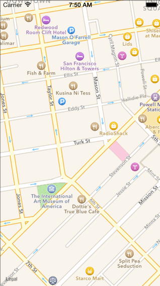
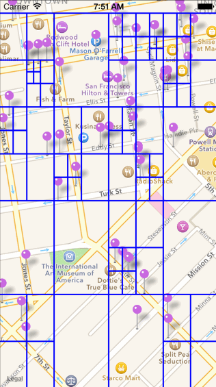
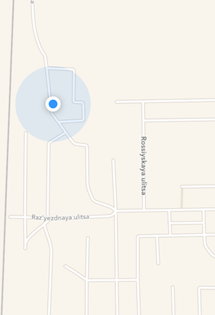
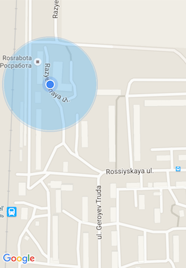
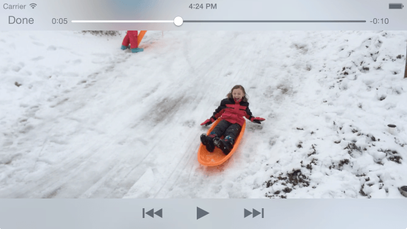
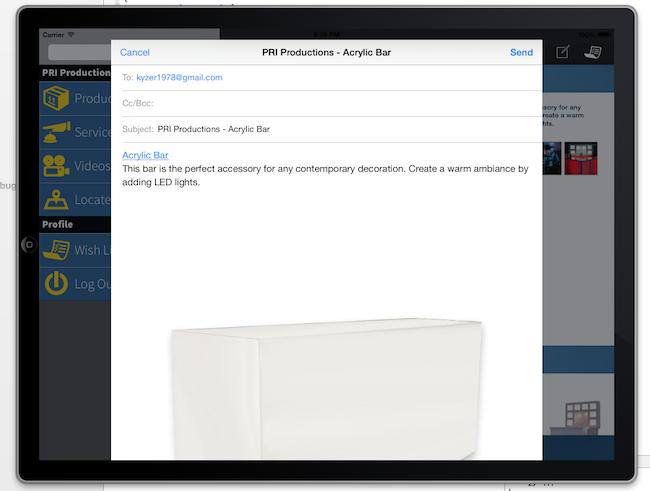
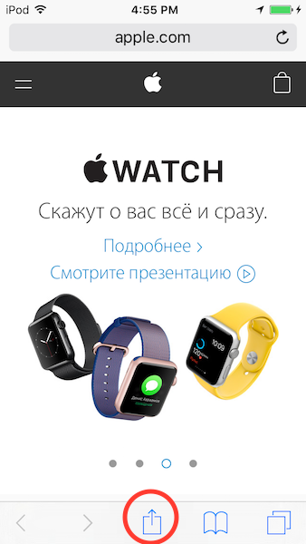
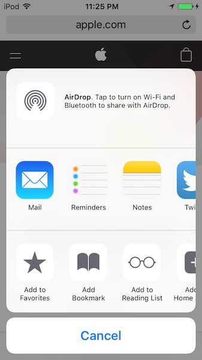

# 11. Навигация, мультимедиа, шаринг

### Noveo University — iOS


----

## Сегодня

* Карты
    * Map Kit framework 
    * Core Location framework
* Мультимедиа
    * Звук
    * Видео
    * Изображения
* Шаринг
    * Email
    * Встроенные соцсети
    * ActivityViewController


----

# Карты


----

## MapKit framework

MapKit предоставляет абстракцию для отображения карты, аннотаций и дополнительных меток, регионов, маршрутов. Начиная с iOS 6 Apple использует свой движок и данные, до этого использовались Google Maps.

Основные классы и протоколы:
* MKMapView
* MKAnnotation
* MKAnnotationView


----

## MKMapView

Показывает карту с центром в заданных координатах
```ObjectiveC
static CLLocationCoordinate2D const CherryLakeLocation = {38.002493, -119.9078987};

- (void)viewDidLoad {
    //...    
    self.mapView = [[MKMapView alloc] initWithFrame:self.view.bounds];

    MKCoordinateRegion newRegion;
    newRegion.center = CherryLakeLocation;
    newRegion.span.latitudeDelta = 5.0;
    newRegion.span.longitudeDelta = 5.0;

    self.mapView.region = newRegion;
}
```


----

## MKMapView
Параметры для кастомизации вида и поведения карты:

```ObjectiveC
@property MKMapType mapType // стандарт/спутник/гибрид
@property MKUserTrackingMode userTrackingMode // следить просто/с направлением
@property BOOL zoomEnabled
@property BOOL scrollEnabled
@property BOOL showsUserLocation
@property BOOL showsPointsOfInterest;
@property BOOL showsTraffic;
// тысячи их
```


----

## MKAnnotation
Стандартный пин
```ObjectiveC
@interface PinAnnotation : NSObject <MKAnnotation>
@property (nonatomic, readwrite) CLLocationCoordinate2D coordinate; //required
@property (nonatomic, copy, readwrite) NSString *title;
@end
 
//...

	PinAnnotation *annotation = [[PinAnnotation alloc] init];
	annotation.coordinate = (CLLocationCoordinate2D) {28.6, 77.2};
	annotation.title = @"New Delhi";
	[self.mapView addAnnotation:annotation];
```


----

## MKAnnotation

Кастомный пин

```ObjectiveC
self.mapView.delegate = self;
//...
 
- (MKAnnotationView *)mapView:(MKMapView *)mapView
    viewForAnnotation:(id<MKAnnotation>)annotation
{
	static NSString *const kAnnotationViewID = @"MyAnnotation";
	
	MKAnnotationView *view =
        [mapView dequeueReusableAnnotationViewWithIdentifier:kAnnotationViewID];
	
	if (view == nil) {
        view = [[MKPinAnnotationView alloc] initWithAnnotation:annotation 
            reuseIdentifier:kAnnotationViewID];
        //...
	}
	
	view.annotation = annotation;
	return view;
}
```


----

## Кластеризация
Из коробки нет, но есть немало библиотек.
Например, FBAnnotationClustering (Filip Beć, not Facebook)

<!-- .element: class="fragment" data-fragment-index="0" -->
<!-- .element: class="fragment" data-fragment-index="1" -->


----

## CLLocationManager
CLLocationManager позволяет:
* Определять координаты и направление.
* Получать уведомления о значительном перемещении.
* Получать уведомления о входе в заданный регион и выходе из него.

Ограничения и возможности:
* Можно указать желаемую точность определения координат, что при продолжительной работе влияет на энергопотребление.
* Уведомления могут быть получены в background-режиме (Пока пользователь явно не убьёт приложение).
* Пользователь может запретить получение координат для нашего приложения.


----

## CLLocationManager 
Обработка локации
```ObjectiveC
@interface MyLocationManager () <CLLocationManagerDelegate>
//...
    self.locationManager = [[CLLocationManager alloc] init];
    self.locationManager.delegate = self;
    self.locationManager.desiredAccuracy = kCLLocationAccuracyBest;
    [self.locationManager startUpdatingLocation];
    // or -(void)startMonitoringSignificantLocationChanges;
//...
- (void)locationManager:(CLLocationManager *)manager
    didUpdateLocations:(NSArray *)locations
{
    CLLocation *location = locations.lastObject;
    [self.locationTracker addLocation:location];
}
``` 


----

## GooleMaps vs MapKit
* \+ для нашей деревни детализация гораздо лучше
* \- хуже интеграция с CoreLocation и CoreAnimation. В гугл-картах пин - это картинка





----

# Мультимедиа

* Проигрывание аудио/видео
* Импорт/экспорт картинок
* Камера


----

## Проигрывание звука
* **Media Player framework** — проигрывание треков из библиотеки устройства.
* **AV Foundation framework** — разносторонняя библиотека:
 * **AVAudioPlayer / AVAudioRecorder** - простое проигрывание / запись звука. Не очень производительная.
 * **AVAudioEngine** - надстройка над **Audio Toolbox framework**.
* **Audio Toolbox framework** — низкоуровневое проигрывание с возможностью синхронизации, парсинга стримов, конвертации аудио-формата, записи с доступом к отдельным пакетам и т.д.
* **Audio Unit framework** — работа с цепочками плагинов, роутинг, синтез и т.д. На нём основаны остальные инструменты аудио iOS, соответственно, тут максимальна производительность.
* **OpenAL framework —** применяется в основном в играх.

Подробнее можно почитать [тут.](https://www.objc.io/issues/24-audio/audio-api-overview/) 

Перед использованием звука очень важно узнать про [сессии](https://developer.apple.com/library/ios/documentation/UserExperience/Conceptual/MobileHIG/Sound.html)


----

## AVAudioPlayer 
* Не самый производительный (не подойдёт для приложения-метронома)
* Не самый большой уровень контроля (не подойдёт для dj-плеера)
* Самый простой способ проиграть аудио (подойдёт для фоновой музыки в приложении)

```ObjectiveC
NSURL* musicFile = [NSURL fileURLWithPath:
    [[NSBundle mainBundle] pathForResource:@"jahkutia" ofType:@"mp3"]]; 
	
NSError *error = nil;
self.avPlayer = [[AVAudioPlayer alloc] initWithContentsOfURL:musicFile error:&error];
self.avPlayer.numberOfLoops = -1;
[self.avPlayer play];
```


----

## Выбор аудио - MPMediaPickerController
```ObjectiveC
    MPMediaPickerController *mediaPicker = [[MPMediaPickerController alloc] 
        initWithMediaTypes:MPMediaTypeMusic];
    mediaPicker.delegate = self;
    mediaPicker.allowsPickingMultipleItems = NO; // this is the default
    [self presentViewController:mediaPicker animated:YES completion:nil];
//...
-(void)mediaPicker:(MPMediaPickerController *)mediaPicker 
    didPickMediaItems:(MPMediaItemCollection *)collection 
{
    [self dismissViewControllerAnimated:YES completion:nil];

    MPMediaItem *song = [[mediaItemCollection items] objectAtIndex:0];
    MPMusicPlayerController *controller = 
        [MPMusicPlayerController applicationMusicPlayer];
    [controller setQueueWithItemCollection:collection];
    [controller setNowPlayingItem:song];
    
    [controller prepareToPlay];
    [controller play];
    //NSURL *audioURL = [item valueForProperty:MPMediaItemPropertyAssetURL]
}
```


----

## Видео


----

## AVPlayerViewController
 
* используется для показа видео
* поддерживает проигрывание локальных файлов и стриминг
* позволяет использовать стандартные контролы или реализовать свои
* поддерживает паузу, перемотку, автостарт (по готовности буфера), закольцовывание
* позволяет получать некоторые метаданные из потока


----

## AVPlayerViewController




----

## AVPlayerViewController 

```ObjectiveC
@import AVFoundation;
@import AVKit;

@property (nonatomic, strong) AVPlayerViewController *avPlayerVC;
//...
 
NSURL *videoURL =
    [NSURL URLWithString:@"http://clips.vorwaerts-gmbh.de/big_buck_bunny.mp4"];
self.avPlayerVC = [[AVPlayerViewController alloc] init];
self.avPlayerVC.player = [AVPlayer playerWithURL:videoURL];

[self addChildViewController:self.avPlayerVC];
[self.view addSubview:self.avPlayerVC.view];
self.avPlayerVC.view.frame = self.view.frame;

[self.avPlayerVC.player play];
```


----

## Картинки


----

## UIImagePickerController
```UIImagePickerController``` —  универсальный способ получения картинок и видео из фотоальбомов устройства и с камеры. Предоставляет стандартные контролы для выбора картинок и управления камерой. 


----

## UIImagePickerController


----

## UIImagePickerController
```ObjectiveC
//UIImagePickerControllerSourceTypePhotoLibrary,
//UIImagePickerControllerSourceTypeCamera,
//UIImagePickerControllerSourceTypeSavedPhotosAlbum

- (void)showImagePickerControllerWithSourceType:
    (UIImagePickerControllerSourceType)sourceType
{
    UIImagePickerController *picker = [[UIImagePickerController alloc] init];
    picker.sourceType = sourceType;
    picker.delegate = self;
    
    [self.presentingVC presentViewController:picker animated:YES completion:nil];
}

- (void)imagePickerController:(UIImagePickerController *)picker
    didFinishPickingMediaWithInfo:(NSDictionary *)info
{
    [picker dismissViewControllerAnimated:YES completion:nil];
    UIImage *pickedImage = info[UIImagePickerControllerOriginalImage];
}
```


----

## Экспорт картинок
```ObjectiveC
@import Photos;
//...

[[PHPhotoLibrary sharedPhotoLibrary] performChanges:^{
    [PHAssetChangeRequest creationRequestForAssetFromImage:<Your image>];
} completionHandler:^(BOOL success, NSError *error) {
    if (success) {
        //...
    }
    else {
        //...
    }
}];
```


----

## Шаринг
* Email
* Facebook
* Twitter
* ...


----

## Email
```MFMailComposeViewController``` позволяет составить черновик письма и показать его пользователю.
* Предустановка темы, текста, вложений, получателей
* Нельзя отправить письмо, можно только предложить
* Работает только если настроена учётная запись в стандартном приложении Mail
* В целях безопасности начиная с iOS 6 реализовано через XPC (контроллер создаётся в стороннем процессе, к которому у приложения нет доступа)

```MFMessageComposeViewController``` — аналогичное API для составления  SMS/MMS


----

## Email




----

## Email
```ObjectiveC
@import MessageUI;
///...
self.mailComposer = [[MFMailComposeViewController alloc] init];
self.mailComposer.mailComposeDelegate = self;
[self.mailComposer setSubject:@"Some subject"];
[self.mailComposer setMessageBody:@"Hello world." isHTML:NO];
[self.mailComposer
    addAttachmentData:UIImageJPEGRepresentation(self.imageView.image, 0.8)
    mimeType:@"image/jpeg"
    fileName:@"MyPhoto.jpg"];
[self presentViewController:self.mailComposer animated:YES completion:nil];
//...

- (void)mailComposeController:(MFMailComposeViewController *)controller
    didFinishWithResult:(MFMailComposeResult)result
    error:(nullable NSError *)error
{
    [self dismissViewControllerAnimated:YES completion:nil];
    //Обработка результата
}
```


----

## Социализация
Social framework предоставляет универсальный способ шаринга на разные социальные платформы.
* Работает только при наличии соответствующего аккаунта в настройках устройства
* Простое и удобное API (в сравнении с Facebook SDK и особенно Twitter API)
* Удобно (без ввода пароля), привычно и безопасно для пользователя
* Мало возможностей (нет хитрых поисковых запросов, токен напрямую не доступен, кастомизации интерфейса).
* Абстрагирует от способов отправки: приложение проработает без исправлений дольше при изменении политик Facebook

Facebook, Twitter, LinkedIn, Sina/Tencent Weibo


----

## Social framework
```ObjectiveC
SLComposeViewController *slController = [SLComposeViewController
    composeViewControllerForServiceType:SLServiceTypeFacebook];
[slController setInitialText:@"Awesome post..."];
[slController addImage:self.imageView.image];
slController.completionHandler = ^(SLComposeViewControllerResult result) {
    [self dismissViewControllerAnimated:NO completion:nil];
    //Обработка результатов
    //...
};
[self presentViewController:slController animated:YES completion:nil];
```


----

## UIActivityViewController




----

## UIActivityViewController
````ObjectiveC
NSArray<__kindof UIActivity *> *customActivities = @[];
NSArray *activityItems = @[self.imageView.image, @"Some text"];

UIActivityViewController *activityViewController = [[UIActivityViewController alloc]
    initWithActivityItems:activityItems
    applicationActivities:customActivities];

activityViewController.excludedActivityTypes = @[
    UIActivityTypePostToVimeo
];

[self presentViewController:activityViewController animated:YES completion:nil];
````

