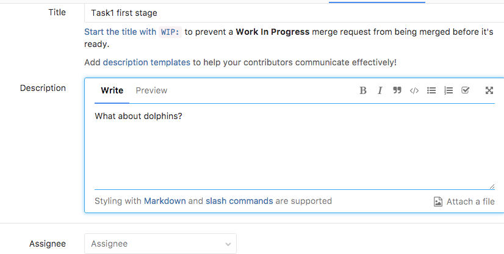

# 0. Intro

### Noveo University — iOS

----

## Полезные ссылки

* [Расписание](https://mail10.noveogroup.com/owa/redir.aspx?C=Mb55E1_S4k--K63z_sxCYV_1p0KYVNQIccLL3Yj95-VGix0qb7kAInKp2LazSOaOSLx9lyI48sY.&URL=https%3a%2f%2fdocs.google.com%2fspreadsheets%2fd%2f1w1fhS69VuHIh9Aa3mbDhzXkaZXx00lWWXlSOcVala9g%2fedit%3fusp%3dsharing)
* [Журнал](https://docs.google.com/spreadsheets/d/1d5S0qqf4Wm9MS_U0nTIL1jETwpWNe3k8E4jtdvVA4xM/edit?usp=sharing)
* [Slack](https://noveo-ios-2017w.slack.com) - приоритетный канал общения

----

## Как выполнять лабораторную?

(Смотри вниз)

--

## Шаг 1 - открыть ссылку на лабораторную

--

## Шаг 2 - нажать fork

-- 

## Шаг 3 - выполнить задание

-- 

## Шаг 4 - создать Merge Request

--

## Шаг 5 - проверить сливаемые ветки

--

## Шаг 6 - заполнить дополнительную информацию

--

## Дальше используем комментарии

----

## Лабораторные

* Дедлайн - **4 рабочих дня включительно** (указан в расписании).
* В конце дедлайна ставится оценка, критерии - в журнале.
* Сдача лаборных - итеративный процесс. Чем раньше начать сдавать, тем больше итераций можно пройти, и тем лучшего итогового качества можно добиться.

----

## Кураторы:

* Семён Игнатов: [**@signatov**](https://noveo-ios-2017w.slack.com/messages/@signatov/), room 15
* Виктория Демина: [**@viktoriya.demina**](https://noveo-ios-2017w.slack.com/messages/@viktoriya.demina/), room 15
* Дмитрий Горев: [**@dgorev**](https://noveo-ios-2017w.slack.com/messages/@dgorev/), room 10
* Михаил Демидов: [**@mikedemidov**](https://noveo-ios-2017w.slack.com/messages/@mikedemidov/), room 13