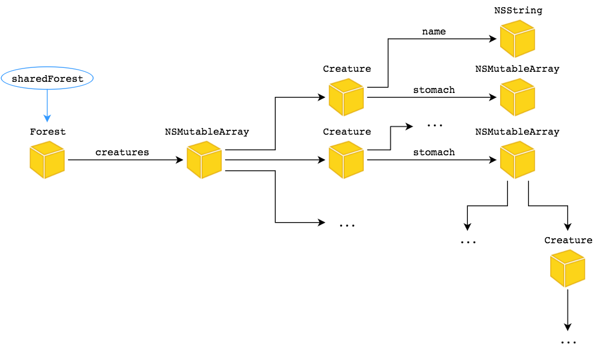
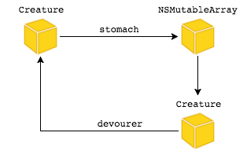

# 2 Основы управления памятью, блоки

### Noveo University — iOS


----

## Сегодня

* Основы управления памятью
* Automatic Reference Counting
* Блоки


----

## Типы памяти

* __Статическая память__ содержит глобальные и статические скалярные переменные и ссылки на объекты
* __Локальная (стековая) память__ выделяется при входе в подпрограмму (метод, функцию) и освобождается при выходе из нее
* __Динамическая память__ выделяется в рантайме и управляется кодом


----

## Управление динамической памятью

* Динамическое выделение памяти
* Использование выделенной памяти
* Высвобождение выделенной памяти


----

## Виды управления памятью

* Ручное управление
  * new, calloc, malloc, delete, free
  * Smart pointers (Boost / STL)
  * Manual Retain-Release (MRR)
* Автоматическое управление
  * Garbage collection (GC)
  * Automatic Reference Counting (ARC)


----

## Проблемы ручного управления памятью

* Освобождение (перезапись) данных, которые все еще используются
* Исполнение программы без освобождения памяти, занятой более ненужными данными


----

## Эффективное управление памятью

Использование номинально необходимого объема выделяемой памяти, достигается за счет:
* Выделения памяти по необходимости
* Совместного использования данных
* Своевременного удаления ненужных объектов (данных)


----

## Основные положения

* Управление памятью объектов базируется на объектом "владении" (ownership)
* К управлению связями между объектами следует подходить с позиции "объектных графов". *Объектный граф - группа объектов, которые соединены в сеть по средствам установления тех или иных отношений между ними.*
* Объект живет пока имеет одного или нескольких владельцев
* Объект умирает когда больше не имеет владельцев


----

## Объектный граф




----

## Управление счетчиком ссылок

* Методы `alloc`, `new`, `copy`, `mutableCopy` возвращают объекты с счетчиком ссылок равным единице*
* Метод `retain` увеличивает счетчик на единицу
* Метод `release` уменьшает счетчик на единицу
* Метод `autorelease` выполняет отложенное уменьшение счетчика на единицу

\*На самом деле не всегда, но мы должны так считать


----

## Пример

```ObjectiveC
NSMutableArray *array = [[NSMutableArray alloc] init];
NSLog(@"%ld", array.retainCount); //1
[array retain]; //2
[array retain]; //3
[array release]; //2
[array autorelease]; //2

NSMutableArray *arrayCopy = [array mutableCopy]; //1
[arrayCopy release]; //0
[arrayCopy release]; //Exception - zombie
```


----

## Пример


----

## Пример


----

## Используя ARC, вам не нужно заниматься ручным управлением памяти


----

## ARC

Концептуально - это то же ручное управление, но:

* Вызовы `retain`, `release`, `autorelease` добавляются автоматически на этапе компиляции. Прямые вызовы этих методов запрещены.
* Автоматически формируется метод `dealloc`. Вызов `super dealloc` запрещен.
* Объект существует ровно столько, сколько необходимо, но не более того.
* ARC не запускает дополнительных фоновых процессов в runtime. 
* **ARC не решает проблему циклических ссылок (retain cycle)**


----

## ARC

Ссылки бывают:

* Сильные (strong) - означает "владею". Увеличивате счетчик ссылок.
* Слабые (weak, assign, unsafe_unretained) - означает "интересуюсь". **Не** увеличивает счетчик ссылок.

По умолчанию все ссылки сильные.


----

## ARC - пример

```ObjectiveC
@interface Creature : NSObject

@property (nonatomic, strong) NSNumber *calories;
@property (nonatomic, strong) NSArray<Creature *> *stomach;
@property (nonatomic, strong) Creature *devourer;

@end
```

Циклическая зависимость<!-- .element: class="fragment" data-fragment-index="1" -->

<!-- .element: class="fragment" data-fragment-index="1" -->


----

## ARC - пример

Creature не владеет своим пожирателем!

```ObjectiveC
@interface Creature : NSObject

@property (nonatomic, strong) NSNumber *calories;
@property (nonatomic, strong) NSArray<Creature *> *stomach;
@property (nonatomic, weak) Creature *devourer;

@end
```


<!-- .element: class="fragment" -->


----

## Циклические ссылки

Но и созданиями в своём желудке он тоже не владеет

```ObjectiveC
@class Creature;

@interface CreatureWeakWrapper : NSObject
@property (nonatomic, weak) Creature *creature;
@end

@interface Creature : NSObject

@property (nonatomic, strong) NSNumber *calories;
@property (nonatomic, strong) NSArray<CreatureWeakWrapper *> *stomach;
@property (nonatomic, weak) Creature *devourer;

@end
```


<!-- .element: class="fragment" -->


----

## Классификаторы времени жизни

К переменным применимы следующие классификаторы:
* __strong (по умолчанию для объектов)
* __weak
* __unsafe_unretained
* __autoreleasing


----

## Классификаторы времени жизни

Оформляйте классификаторы правильно!

`ClassName *qualifier variable;`


----

## Пример

```ObjectiveC
MyClass *__weak weakReference = ...;

MyClass *__unsafe_unretained unsafeReference = ...;
```


----

## Диагностика управления памятью

* Clang Static Analyzer
* Developer Tools - Instruments


----

# Блоки в Objective-C


----

## Блок

* Функция
* Может иметь входные параметры
* Может возвращать значение
* Является объектом<!-- .element: class="fragment" data-fragment-index="1" -->
* Может ссылаться на свой контекст<!-- .element: class="fragment" data-fragment-index="1" -->
* Может модифицировать свой контекст<!-- .element: class="fragment" data-fragment-index="1" -->
* Может захватывать свой контекст<!-- .element: class="fragment" data-fragment-index="1" -->


----

## Блоки в Objective-C

* Функция
* Может иметь входные параметры
* Может возвращать значение

Блок, как локальная переменная:
```ObjectiveC
returnType (^blockName)(parametersTypes) = ^returnType(parameters) {...};
```

Пример:
```ObjectiveC
int (^summ)(int, int) = ^(int a, int b) {
    return a + b;
}

int s = summ(1,2);
```


----

## Блоки в Objective-C

* Является объектом

Блок, как свойство: 
```ObjectiveC
@property (nonatomic, copy) returnType (^blockName)(parameterTypes);
```
и typedef:
```ObjectiveC
typedef returnType (^TypeName)(parameterTypes);
TypeName blockName = ^returnType(parameters) {...};
```

Пример:
```ObjectiveC
typedef int(^blockType)(int, int);
```
```ObjectiveC
@property (nonatomic, copy) blockType mySumm;
```
```ObjectiveC
blockType summ = ^(int a, int b) {
    return a + b;
}
self.myBlock = block;
int resultA = block(3, 5);
int resultB = self.myBlock(3, 5);
```


----

## Блоки в Objective-C

* Может ссылаться на свой контекст

```ObjectiveC
int b = arc4random_uniform(10);

int (^increase)(int) = ^(int a) {
    return a + b;
}

int s = increase(5);
```


----

## Блоки в Objective-C

* Может модифицировать свой контекст (модификатор __block)

```ObjectiveC
__block int c;

void (^saveSummToC)(int, int) = ^(int a, int b) {
    c = a + b;
}
```


----

## Блоки в Objective-C

* Может захватывать свой контекст

```ObjectiveC
NSString *firstName = @"James";
NSString *lastName = @"Bond";

int nameLength = name.length;

void (^captureContext)() = ^() {
    NSString *fullName = [name stringByAppendingString:lastName]; //"JamesBond"
    
    NSString *calculatedLastName = [fullName substringFromIndex:nameLength];
    NSLog(@"%@", calculatedLastName); //"Bond"
}
```


----

## Блоки в Objective-C

Блок, как аргумент в вызове метода:
```ObjectiveC
[someObject someMethodThatTakesABlock:^returnType(parameters){...}];
```

Пример:
```ObjectiveC
NSArray<NSString *> *array = @[@"a", @"s", @"d", @"f", @"g", @"h"];
NSUInteger maxElements = 5;
[array enumerateObjectsUsingBlock:^(id obj, NSUInteger idx, BOOL *stop) {
       NSLog(@"Element %d : %@", idx, obj);
      stop = idx >= maxElements;
}];
```


----


## Блоки в Objective-C

```ObjectiveC
- (void)randomlyCallSuccess:(void(^)(int a))success
    orFailure:(void(^)())failure
{
    int randomNumber = arc4random_uniform(100);
    if (randomNumber%2 == 0) {
        success(randomNumber);
    }
    else {
        failure();
    }
}
```

```ObjectiveC
void (^callRandom)() = ^(){
    [self randomlyCallSuccess:^(int a) {
            NSLog(@"%d", a);
        }
        orFailure:^{
            NSLog(@"failed");
        }];
};

while (1) {
    sleep(0.5);
    callRandom();
}
```

Осторожнее со вложенностью!<!-- .element: class="fragment" data-fragment-index="1" -->


----

## Блоки в Objective-C

```ObjectiveC
@interface Number : NSObject

@property (nonatomic, copy) void (^changedCallback)();
@property (nonatomic, getter = isEven) BOOL even;

@end

@implementation Number

- (void)configure
{
    self.changedCallback = ^(){
        NSLog(@"%@ %d", self.description, _even);
    };
}

@end
```

циклическая зависимость<!-- .element: class="fragment" data-fragment-index="1" -->


----

## Блоки в Objective-C

```ObjectiveC
@interface Number : NSObject

@property (nonatomic, copy) void (^changedCallback)();

@end

@implementation Number

- (void)configure
{
    typeof(self) __weak wself = self;
    self.changedCallback = ^(){
        NSLog(@"%@", wself.description);
    };
}

@end
```


----

## Блоки в Objective-C

Чтобы избежать ситуации, когда объект будет уничтожен во время исполнения блока

```ObjectiveC
@interface Number : NSObject

@property (nonatomic, copy) void (^changedCallback)();

@end

@implementation Number

- (void)configure
{
    typeof(self) __weak wself = self;
    self.changedCallback = ^(){
        typeof(wself) __strong sself = wself;
        NSLog(@"%@", sself.description);
        NSLog(@"I repeat: %@", sself.description);
    };
}

@end
```


----

## Справочная литература

[Block declaration cheatsheet](http://fuckingblocksyntax.com/)

[Официальная документация](https://developer.apple.com/library/content/documentation/Cocoa/Conceptual/ProgrammingWithObjectiveC/WorkingwithBlocks/WorkingwithBlocks.html)

[ARC Best Practices](http://amattn.com/p/arc_best_practices.html)

[Transitioning to ARC Release Notes](https://developer.apple.com/library/ios/releasenotes/ObjectiveC/RN-TransitioningToARC/Introduction/Introduction.html#//apple_ref/doc/uid/TP40011226-CH1-SW11)

[Toll-Free Bridged Types*](https://developer.apple.com/library/ios/documentation/CoreFoundation/Conceptual/CFDesignConcepts/Articles/tollFreeBridgedTypes.html#//apple_ref/doc/uid/TP40010677)