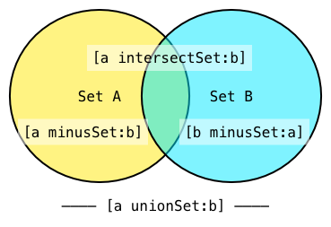

# 4. Foundation framework

### Noveo University — iOS


----

## План лекции

* Что такое Foundation?
* Строки (`NSString`)
* Обертки (`NSData`, `NSValue`, `NSNumber`)
* Коллекции (`NSArray`, `NSDictionary`, `NSSet`)
* Дата и время (`NSDate`)
* Ошибки (`NSError`, `NSException`)
* Бонус


----

## Foundation

* Фреймворк, созданный Apple, который доступен как iOS, так и macOS разработчикам.
* Фреймворк играет роль «базы» Objective-C классов и позволяет в некоторой мере абстрагироваться от конкретной ОС.


----

## Справочная литература

* [Документация Apple](https://developer.apple.com/library/ios/navigation/)
* [NSHipster](http://nshipster.com)
* [RyPress](http://rypress.com)


----

## [NSString и NSMutableString](https://developer.apple.com/library/mac/documentation/Cocoa/Conceptual/Strings/Articles/Strings.html#//apple_ref/doc/uid/20000145-BBCCGGCC)


--

## C string vs NSString

`C string`

```ObjectiveC
const char *cString = "Hello world";
```

`NSString`

```ObjectiveC
NSString *objCString = @"Hello world";
```


--

## - stringWithFormat:

```ObjectiveC
int year = 2017;
NSString *message = [NSString stringWithFormat:@"Today is year %d", year];
// Today is year 2017

NSString *anotherMessage =
	[NSString stringWithFormat:@"Previous message was '%@'", message];
// Previous message was 'Today is year 2017'
```

Самый часто используемый метод у строк.


--

## Спецификаторы формата (format specifier)

Точно такие же, как у `printf` + <font color="red">`%@`</font> для объектов.

Основные:
* <font color="blue">`%d`</font>, <font color="blue">`%i`</font> - для `int`
* <font color="blue">`%f`</font> - для `float`
* <font color="blue">`%s`</font> - для строки `C`


--

## NSRange

```Objective-C
typedef struct _NSRange {
    NSUInteger location;
    NSUInteger length;
} NSRange;
```

**NSRange** используется для описания непрерывного интервала целых чисел. Наиболее часто используется со строками, массивами, упорядоченными коллекциями для замены элементов или поиска вхождений. Если ничего найти не удалось, будет возвращено **NSNotFound** в `location`.


--

## Применение NSRange

```ObjectiveC
NSString *s = @"Student name: Ivan";
NSRange range1 = NSMakeRange(14, 4);
NSLog(@"%@", [s substringWithRange:r]); // Ivan

NSRange range2 = [@"Porsche Carrera" rangeOfString:@"Car"];
NSLog(@"Case 1: %@", NSStringFromRange(range2)); // Case 1: {8, 3}
NSLog(@"Case 2: %@", [NSValue valueWithRange:range2]); // Case 2: NSRange: {8, 3} 
```


--

## И еще пара методов

```ObjectiveC
int length = [@"Hello world" length]; // 11
	
unichar ch = [@"Abcdef" characterAtIndex:3];
NSLog(@"%c", ch); // d
```

Довольно редко используются.


--

## Создание новых строк на основе имеющихся

```ObjectiveC
NSString *name = @"Steve";
NSString *surname = @"Jobs";
NSString *space = @" ";
NSString *fullName = [[name stringByAppendingString:space]
	stringByAppendingString:surname];
// Steve Jobs
NSString *king = @"King";
NSString *otherFullName = [[fullName stringByReplacingOccurrencesOfString:surname
	withString:king] stringByReplacingOccurrencesOfString:space withString:@"n "];
// Steven King
```

Методы, создающие новую строку из имеющейся, обычно начинаются со `stringBy...`..


--

## Получение подстроки

```ObjectiveC
NSString *car = @"Porsche Carrera";
NSString *model = [car substringFromIndex:8]; //Carrera
```


--

## Смена регистра

```ObjectiveC
NSString *st = @"sTRinG";
NSString *lower = [st lowercaseString]; // string
NSString *upper = [st uppercaseString]; // STRING
NSString *capital = [st capitalizedString]; // String
```


--

## NSMutableString

Строка **NSString** <font color="red">неизменяема.</font>

Однако, у **NSString** есть подкласс **NSMutableString** - для <font color="green">изменяемых</font> строк.


--

## Дополнительные методы

```ObjectiveC
- (void)insertString:(NSString *)aString atIndex:(NSUInteger)loc;
- (void)deleteCharactersInRange:(NSRange)range;
- (void)appendString:(NSString *)aString;
- (void)appendFormat:(NSString *)format, ... NS_FORMAT_FUNCTION(1,2);
- (void)setString:(NSString *)aString;
```


--

## Пример

```ObjectiveC
NSMutableString *st = @"Mutable string";
[st appendString:@" ****"];
```
Что произойдёт?

<fragment>
<font color="red">\*\*\* Terminating app due to uncaught exception 'NSInvalidArgumentException', reason: 'Attempt to mutate immutable object with appendString:'</font>
</fragment>
<!-- .element: class="fragment" -->


--

## Правильная реализация

```ObjectiveC
NSMutableString *st = [@"Mutable string" mutableCopy];
```

или так:

```ObjectiveC
NSString *st = [[NSMutableString alloc] initWithString:@"Mutable string"];
```


----

## NSValue


--

## Назначение

`NSValue` представляет собой простой контейнер для `Objective-C` и `C` данных и применяется для создания объектов из скалярных данных.

Объекты класса `NSValue` способны сохранить любые скаларные данные, такие как, `int`, `float`, `char`, указатели, структуры, `id`. Созданный объект являются не изменяемыми и может разместить только один элемент данных.


--

## Хранить можно не все

Объекты класса `NSValue` могу размещать данные с постоянной длинной, вы не можете сохранить в объекте `C`-строки, массивы переменной длины, структуры или другие данные неопределенной длинны.


--

## Создание NSValue

```ObjectiveC
- (instancetype)initWithBytes:(const void *)value objCType:(const char *)type;
+ (NSValue *)valueWithBytes:(const void *)value objCType:(const char *)type;
```

Где взять этот самый `objCType`?


--

## @encode

В Objective-C у любого типа существует его внутреннее представление в виде строки С. 

Его можно получить с помощью **@encode**.

Например, **@encode(id) == <font color="red">"@"</font>**.


--

## -getValue: и objCType

```ObjectiveC
- (void)getValue:(void *)value;
```

Копирует значение в заданный буфер. Он должен быть достаточно большого размера.

```ObjectiveC
@property (readonly) const char *objCType
```

Возвращает `C`-строку с описанием типа данных хранимых в объекте класса `NSValue`.


--

## Пример

```ObjectiveC
typedef struct Str {
	int x;
	char y;
} MyStruct;
MyStruct s = (MyStruct){.x = 100, .y = 'x'};
NSValue *val = [NSValue value:&s withObjCType:@encode(MyStruct)];
	
MyStruct s2;
[val getValue:&s2];
	
NSLog(@"%i, %c", s2.x, s2.y);
```


--

## Полезные методы

```ObjectiveC
+ valueWithCGPoint:
+ valueWithCGSize:
+ valueWithCGRect:
+ valueWithRange: // для NSRange

@property(nonatomic, readonly) CGPoint CGPointValue;
@property(nonatomic, readonly) CGSize CGSizeValue;
@property(nonatomic, readonly) CGRect CGRectValue;
@property (readonly) NSRange rangeValue;
```


--

## Дополнительно

[NSValue на NSHipster](http://nshipster.com/nsvalue/)

[Type Encodings на NSHipster](http://nshipster.com/type-encodings/)

[NSValue в документации Apple](https://developer.apple.com/library/ios/documentation/Cocoa/Conceptual/NumbersandValues/NumbersandValues.pdf)


----

## NSNumber


--

## Назначение

Класс `NSNumber` является подклассом `NSValue`, объекты которого позволяют хранить значения скалярных числовых типов языка `С`. 


--

## Создание NSNumber

```ObjectiveC
- (NSNumber *)initWithChar:(char)value;
- (NSNumber *)initWithUnsignedChar:(unsigned char)value;
- (NSNumber *)initWithShort:(short)value;
- (NSNumber *)initWithUnsignedShort:(unsigned short)value;
- (NSNumber *)initWithInt:(int)value;
- (NSNumber *)initWithUnsignedInt:(unsigned int)value;
- (NSNumber *)initWithLong:(long)value;
- (NSNumber *)initWithUnsignedLong:(unsigned long)value;
- (NSNumber *)initWithLongLong:(long long)value;
- (NSNumber *)initWithUnsignedLongLong:(unsigned long long)value;
- (NSNumber *)initWithFloat:(float)value;
- (NSNumber *)initWithDouble:(double)value;
- (NSNumber *)initWithBool:(BOOL)value;
- (NSNumber *)initWithInteger:(NSInteger)value NS_AVAILABLE(10_5, 2_0);
- (NSNumber *)initWithUnsignedInteger:(NSUInteger)value NS_AVAILABLE(10_5, 2_0);
```


--

## Пример

```ObjectiveC
NSNumber *pi = [NSNumber numberWithFloat:3.1415];
NSNumber *i = [NSNumber initWithInt:2];
```

Долго и нудно :)


--

## Создание NSNumber по-новому 

```ObjectiveC
NSNumber *pi = @3.1415;
NSNumber *i = @2;
	
NSNumber *someSum = @(3.1415 + 2.71);
```

на самом деле, тут продолжает вызываться
метод `numberWithFloat:`, `initWithInt:` или подобные, просто
теперь компилятор это делает сам.


--

## Получить число

```ObjectiveC
@property (readonly) char charValue;
@property (readonly) unsigned char unsignedCharValue;
@property (readonly) short shortValue;
@property (readonly) unsigned short unsignedShortValue;
@property (readonly) int intValue;
@property (readonly) unsigned int unsignedIntValue;
@property (readonly) long longValue;
@property (readonly) unsigned long unsignedLongValue;
@property (readonly) long long longLongValue;
@property (readonly) unsigned long long unsignedLongLongValue;
@property (readonly) float floatValue;
@property (readonly) double doubleValue;
@property (readonly) BOOL boolValue;
@property (readonly) NSInteger integerValue NS_AVAILABLE(10_5, 2_0);
@property (readonly) NSUInteger unsignedIntegerValue NS_AVAILABLE(10_5, 2_0);
@property (readonly, copy) NSString *stringValue;
```


--

## Дополнительные методы

Также `NSNumber` можно сравнивать

```ObjectiveC
- (NSComparisonResult)compare:(NSNumber *)otherNumber;
- (BOOL)isEqualToNumber:(NSNumber *)number;
```


--

## Вопрос

```ObjectiveC
NSNumber *pi = @3.1415;
NSLog(@"%?", pi);
```

Какой `format specifier` нужно подставить вместо <font color="green">**%?**</font> ?	

<fragment>
Нужно использовать <font color="red">**%@**</font>, так как NSNumber — это объект.
</fragment>
<!-- .element: class="fragment" data-fragment-index="3" -->


--

## Вопрос

Что будет, если поместить в `NSNumber` число одного типа, а обратно пытаться получить другое?

```ObjectiveC
NSNumber *e = @2.71;
[e intValue];
[e boolValue];
```


--

## Дополнительно

[NSNumber на RyPress](http://rypress.com/tutorials/objective-c/data-types/nsnumber)

[NSDecimalNumber на RyPress](http://rypress.com/tutorials/objective-c/data-types/nsdecimalnumber)


----

## NSData + NSMutableData


--

## NSData

**NSData** - представляет собой объект Cocoa для работы с бинарными данными.
Многие методы для работы с интернетом возвращают **NSData** в качестве результата.


--

## bytes & length

В общем **NSData** — это указатель на данные *bytes* и размер данных *length* (в байтах)

```ObjectiveC
- (id)initWithBytes:(const void *)bytes
    length:(NSUInteger)length;

@property (readonly) NSUInteger length;
@property (readonly) const void *bytes NS_RETURNS_INNER_POINTER;
```


--

## Пример

```ObjectiveC
int x = 2014;
NSData *data = [NSData dataWithBytes:&x length:sizeof(x)];
NSLog(@"%@", data); // de070000
```


--

## Инициализация NSData

```ObjectiveC
- (instancetype)initWithBytes:(nullable const void *)bytes
		length:(NSUInteger)length;
- (instancetype)initWithBytesNoCopy:(void *)bytes length:(NSUInteger)length;
- (instancetype)initWithBytesNoCopy:(void *)bytes
		length:(NSUInteger)length
		freeWhenDone:(BOOL)b;
- (nullable instancetype)initWithContentsOfFile:(NSString *)path
		options:(NSDataReadingOptions)readOptionsMask
		error:(NSError **)errorPtr;
- (nullable instancetype)initWithContentsOfURL:(NSURL *)url
		options:(NSDataReadingOptions)readOptionsMask
		error:(NSError **)errorPtr;
- (nullable instancetype)initWithContentsOfFile:(NSString *)path;
- (nullable instancetype)initWithContentsOfURL:(NSURL *)url;
- (instancetype)initWithData:(NSData *)data;
```


--

## Сохранение в файл/URL

```ObjectiveC
- (BOOL)writeToFile:(NSString *)path atomically:(BOOL)useAuxiliaryFile;
- (BOOL)writeToURL:(NSURL *)url atomically:(BOOL)atomically;
- (BOOL)writeToFile:(NSString *)path
    options:(NSDataWritingOptions)writeOptionsMask
    error:(NSError **)errorPtr;
- (BOOL)writeToURL:(NSURL *)url
    options:(NSDataWritingOptions)writeOptionsMask
    error:(NSError **)errorPtr;
```


--

## Поиск/получение подданных

```ObjectiveC
- (NSRange)rangeOfData:(NSData *)dataToFind
    options:(NSDataSearchOptions)mask
    range:(NSRange)searchRange;

- (NSData *)subdataWithRange:(NSRange)range;
```


--

## NSDataSearchOptions

```ObjectiveC
typedef NS_OPTIONS(NSUInteger, NSDataSearchOptions) {
	NSDataSearchBackwards = 1UL << 0,
	NSDataSearchAnchored = 1UL << 1
};
```


----


## NSNull

Класс `NSNull` представляет из себя контейнер для `NULL` или `nil`, применяется для его размещения в коллекциях и др., которые не позволяют размещать `NULL/nil` значения в явном виде.

У класса есть единственный метод:

```ObjectiveC
+ (NSNull *)null; // синглтон
```

Более подробно о `nil, Nil, NULL, NSNull` можно узнать [в статье](http://nshipster.com/nil/)


----


## Коллекции


--

## Коллекции

Коллекции используются для хранения и управления группами объектов.

* Основные: <font color="red">`NSArray`</font>, <font color="red">`NSDictionary`</font>, <font color="red">`NSSet`</font>
* Специализированные: `NSCountedSet`, `NSOrderedSet`, `NSIndexSet`, `NSCharacterSet`
* Могут быть изменяемые <i>mutable</i> и неизменяемые <i>immutable</i>
* Могут быть типизированные и нетипизированные <i>(`NSArray < NSString *>`, `NSDictionary< Car *>`, `NSSet< UIView *>`)</i>


--

## Коллекции «на каждый день»

* <font color="blue">`NSArray`</font> - массив - упорядоченная коллекция, которые позволяют индексировать доступ к содержимому.
* <font color="blue">`NSDictionary`</font> - словарь - неупорядоченный набор, который позволяют получить доступ к содержимому с помощью ключа-значения.
* <font color="blue">`NSSet`</font> - набор (множество) - неупорядоченная коллекция объектов.


--

## Mutable и Immutable

`NSArray`, `NSDictionary`, `NSSet` - <font color="red">неизменяемые</font>. После их создания ни добавить, ни удалить элементы нельзя.

`NSMutableArray`, `NSMutableDictionary`, `NSMutableSet` - <font color="green">изменяемые</font>.

Изменяемые коллекции наследуются от неизменяемых коллекций.
Для них доступны все методы неизменяемых коллекций, плюс добавляются свои собственные методы.


--

## Типизированные коллекции (Lightweight Generics)

Lightweight Generics позволяет классам в Objective-C быть параметрируемыми по типу, с которым они работают.

```ObjectiveC
NSMutableArray<NSString *> *array = [NSMutableArray array];
[array addObject:@"Some string"];

[array addObject:@5]; 
// Предупреждение на уровне компиляции, но программа будет успешно выполнена!
```


<div>
```ObjectiveC
NSDictionary<NSString *, NSNumber *> *dictionary = @{@"five": @5};
NSSet<NSString *> *set = [NSSet setWithArray:@[@"one", @"two", @"three"]];
```
Не будет хуже, если все коллекции в вашей программе будут типизированными.
</div>
<!-- .element: class="fragment" -->


--

## Как поместить в коллекцию нечто, что не является Objective-C объектом?

* Число (`int, float, BOOL, NSInteger, …`) - используем <font color="blue">`NSNumber`</font>.
* `C struct` - <font color="blue">`NSValue`</font>
* Бинарные данные (`void *`) - <font color="blue">`NSData`</font>.
* Отсутствие данных (`nil`) - <font color="blue">`NSNull`</font>.


--

## Пример

```ObjectiveC
// данные, которые мы хотим поместить в массив
int x = 10;
NSRange range = NSMakeRange(10, 3);
void *pointer = (void *)&range.length;

// обертки для этих данных
NSNumber *xObj = @(x);
NSValue *rangeObj = [NSValue valueWithRange:range];
NSData *pointerObj = [NSData dataWithBytes:pointer length:sizeof(range.length)];

// создание массива
NSArray *array = @[xObj, rangeObj, pointerObj, [NSNull null]];

// получение данных
NSValue *value = (NSValue *)array[1];
NSLog(@"%@", value); // NSRange: {10, 3}
```


----

## NSArray + NSMutableArray


--

## NSArray

* Упорядоченный набор объектов.
* Нумерация начинается с `0`, объекты могут быть любого класса.
* Может быть типизированный и нетипизированный.


--

## Создание массивов

Создание нетипизированного массива
```ObjectiveC
NSArray *array = @[@1, @"Objective-C"];
NSArray *array2 = [NSArray arrayWithArray:array];
NSArray *array3 = [[NSArray alloc] initWithArray:array];
```

<div>
Создание типизированного массива
```ObjectiveC
    NSArray<NSString *> *array = @[@1, @"Objective-C"];
    NSArray<NSObject *> *array2 = [NSArray arrayWithArray:array];
    NSArray<NSString *> *array3 = [[NSArray alloc] initWithArray:array];
```
</div>
<!-- .element: class="fragment" -->

<fragment>
Обычно методам объекта (`-initWithArray:`) соответствует метод класса (`+arrayWithArray:`) с похожим названием.
</fragment>
<!-- .element: class="fragment" -->


--

## Создание нового массива на основе имеющегося

* Дополнить имеющийся массив.
* Получить подмассив из имеющегося массива.
* Сортировать имеющийся массив.


--

## Дополнение массива

```ObjectiveC
- (NSArray *)arrayByAddingObject:(id)anObject;
- (NSArray *)arrayByAddingObjectsFromArray:(NSArray *)otherArray;
```


--

## Взятие подмассива

```ObjectiveC
- (NSArray *)subarrayWithRange:(NSRange)range;
- (NSArray *)filteredArrayUsingPredicate:(NSPredicate *)predicate;
```


--

## Сортировка массива

```ObjectiveC
- (NSArray *)sortedArrayUsingComparator:(NSComparator)cmptr;
- (NSArray *)sortedArrayWithOptions:(NSSortOptions)opts
   usingComparator:(NSComparator)cmpt;
```

```ObjectiveC
typedef NSComparisonResult (^NSComparator)(id obj1, id obj2);
```

```ObjectiveC
typedef NS_OPTIONS(NSUInteger, NSSortOptions) {
    NSSortConcurrent = (1UL << 0),
    NSSortStable = (1UL << 4),
};
```

```ObjectiveC
typedef NS_ENUM(NSInteger, NSComparisonResult) {
	NSOrderedAscending = -1L,
	NSOrderedSame,
	NSOrderedDescending
};
```


--

## Определение размера коллекции

```ObjectiveC
- (NSUInteger)count;
```


--

## Порядковый номер объекта внутри массива

```ObjectiveC
- (NSUInteger)indexOfObject:(id)anObject; 
- (NSUInteger)indexOfObjectIdenticalTo:(id)anObject;
```


--

## Индексы элементов массива, удовлетворяющих заданным условиям

```ObjectiveC
- (NSIndexSet *)indexesOfObjectsWithOptions:(NSEnumerationOptions)opts 
	passingTest:(BOOL (^)(id obj, NSUInteger idx, BOOL *stop))predicate;
```

\+ еще несколько методов.


--

## Чтение массива с «диска» и запись массива на «диск»

```ObjectiveC
- (id)initWithContentsOfFile:(NSString *)path;
- (id)initWithContentsOfURL:(NSURL *)url;

- (BOOL)writeToFile:(NSString *)path atomically:(BOOL)useAuxiliaryFile;
- (BOOL)writeToURL:(NSURL *)url atomically:(BOOL)atomically;
```


--

## И еще пара полезных методов

```ObjectiveC
- (id)firstObject;
- (id)lastObject;
```


--

## Перебор элементов коллекции

* В обычном цикле (подходит для массивов).
* С помощью цикла `for-in` (fast enumeration).
* С помощью блока.


--

## Перебор элементов коллекции при помощи цикла

```ObjectiveC
NSArray *cities = @[@"Moscow", @"St. Petersburg", @"Novosibirsk"];
for (int i = 0; i < [cities count]; i++) {
	NSLog(@"%@", cities[i]);
}
```


--

## Перебор элементов коллекции при помощи fast enumeration

```ObjectiveC
NSArray *cities = @[@"Moscow", @"St. Petersburg", @"Novosibirsk"];
for (NSString *city in cities) {
	NSLog(@"%@", city);
}
```

Ограничение: не поддерживает индексацию.


--

## Перебор элементов коллекции при помощи блока

```ObjectiveC
NSArray *cities = @[@"Moscow", @"St. Petersburg", @"Novosibirsk"];
[cities enumerateObjectsUsingBlock:^(id obj, NSUInteger idx, BOOL *stop) {
		NSLog(@"%@", obj);
}];
```


--

## Fast enumeration & blocks

* Позволяют перебрать элементы <font color="red">*любых*</font> коллекций.
* Fast enumeration поддерживает **break** и **continue**.
* Перебор элементов при помощи блока может быть прерван по средствам **BOOL *stop**.


--

## BOOL *stop

Для того, чтобы прервать операцию перебора необходимо сделать следующее:

```ObjectiveC
*stop = YES;
```


--

## NSMutableArray

```ObjectiveC
- (void)addObject:(id)anObject;
- (void)insertObject:(id)anObject atIndex:(NSUInteger)index;
- (void)removeLastObject;
- (void)removeObjectAtIndex:(NSUInteger)index;
- (void)replaceObjectAtIndex:(NSUInteger)index withObject:(id)anObject;
```


--

## Mutable ⇔ Immutable

```ObjectiveC
NSMutableArray *array = @[@1, @2, @3];
```
Можно ли так делать?

<fragment>
Справа стоит выражение типа **NSArray**. Так присваивать <font color="red">**нельзя**</font> и компилятор об этом предупредит.
</fragment>
<!-- .element: class="fragment" -->


--

## Mutable ⇔ Immutable

```ObjectiveC
NSMutableArray *array = (NSMutableArray *)(@[@1, @2, @3]);
```

```ObjectiveC
[array addObject:@4];
```
<!-- .element: class="fragment" data-fragment-index="2" -->

Что произойдёт теперь?
<fragment>
Предупреждение исчезло, а проблема нет: так все равно <font color="red">**нельзя**</font> делать.
</fragment>
<!-- .element: class="fragment" data-fragment-index="1" -->

<font color="red">**\*\*\* Terminating app due to uncaught exception 'NSInvalidArgumentException', reason: '-[__NSArrayI addObject:]: unrecognized selector sent to instance 0x8d81480'**</font>
<!-- .element: class="fragment" data-fragment-index="3" -->


--

## Правильная реализация

```ObjectiveC
NSMutableArray *array = [@[@1, @2, @3] mutableCopy];
[array addObject:@4];
```

или

```ObjectiveC
NSMutableArray *array = [NSMutableArray arrayWithArray:@[@1, @2, @3]];
[array addObject:@4];
```


--

## Дополнительно

1. [NSArray в документации Apple](https://developer.apple.com/reference/foundation/nsarray)
2. [NSArray на RyPress](http://rypress.com/tutorials/objective-c/data-types/nsarray)
2. [NSMutableArray в документации Apple](https://developer.apple.com/reference/foundation/nsmutablearray)


----

## NSDictionary + NSMutableDictionary


--

## NSDictionary

* Структура данных, хранящая пары *ключ:значение*.
* Ключи должны быть различны и должны удовлетворять протоколу **NSCopying**.
* Обычно в качестве ключей берут **NSString**.
* Может быть типизированный и нетипизированный.


--

## Пример

```ObjectiveC
NSDictionary<NSString *, NSNumber *> *weather = @{
		@"Moscow":@-3, 
		@"Novosibirsk":@-12, 
		@"Saint-Petersburg":@-7
	};	
for (NSString *city in weather) {
	NSLog(@"%@ degrees in %@", weather[city], city);
}
```


--

## Все ключи, все значения

```ObjectiveC
[weather allKeys];
[weather allValues];
```
Обратите внимание, что их порядок не обязан совпадать.


--

## NSMutableDictionary

```ObjectiveC
- (void)removeObjectForKey:(id)aKey;
- (void)setObject:(id)anObject forKey:(id <NSCopying>)aKey;
```
Пример:
```ObjectiveC
[dict setObject:object forKey:key]
```
или то же самое:
```ObjectiveC
dict[key] = object
```


--

## Добавить или изменить пару

```ObjectiveC
NSMutableDictionary *weather = [[NSMutableDictionary alloc] init];
weather[@"Moscow"] = @-3;
//...
weather[@"Moscow"] = @-1;
```
Если по заданному ключу в словаре не было объекта, то ключ добавится, а если такой ключ уже был, то просто изменится значение по этому ключу.


--

## Дополнительно

1. [NSDictionary](https://developer.apple.com/reference/foundation/nsdictionary)
2. [NSDictionary на RyPress](http://rypress.com/tutorials/objective-c/data-types/nsdictionary)
2. [NSMutableDictionary](https://developer.apple.com/reference/foundation/nsmutabledictionary)


----

## NSSet + NSMutableSet


--

## Назначение

* Используется для хранения неупорядоченного набора различных элементов.
* `NSSet` - неизменяемые объекты, `NSMutableSet` - изменяемые объекты, можно производить с ними теоретико-множественные операции.
* Может быть типизированным и нетипизированным.


--

## Использование

* Получение из `NSArray` и возвращение `NSArray` со всеми элементами (нельзя рассчитывать на определенный порядок).
* Проверка утверждения  `x∈A`, `A⊆B` и `A∩B = ∅`.
* Фильтрация.


--

## Получить/вернуть

```ObjectiveC
- (NSArray *)allObjects;
- (id)anyObject;

- (id)initWithArray:(NSArray *)array;
```


--

## Теория множеств



x∈A
```ObjectiveC
- (BOOL)containsObject:(id)anObject;
```
A∩B = ∅
```ObjectiveC
- (BOOL)intersectsSet:(NSSet *)otherSet;
```
A⊆B
```ObjectiveC
- (BOOL)isSubsetOfSet:(NSSet *)otherSet;
```


--

## Фильтрация

```ObjectiveC
- (NSSet *)objectsPassingTest:(BOOL (^)(id obj, BOOL *stop))predicate;
- (NSSet *)objectsWithOptions:(NSEnumerationOptions)opts
		passingTest:(BOOL (^)(id obj, BOOL *stop))predicate;
```


--

## Пример

```ObjectiveC
NSSet *numbers = [NSSet setWithArray: @[@2, @3, @2, @10, @100, @50, @100]];
NSLog(@"%lu", (unsigned long)[numbers count]); // 5
NSSet *numbers2 = [NSSet setWithArray: @[@2, @3]];
NSLog(@"%d", [numbers2 isSubsetOfSet: numbers]); // 1
NSLog(@"%d", [numbers containsObject: @2]); // 1
NSLog(@"%d", [numbers2 intersectsSet: numbers]); // 1
	
NSSet *lessThan50 = [numbers objectsPassingTest:^BOOL(id obj, BOOL *stop) {
		return [obj intValue] < 50;
	}];
NSLog(@"%@", lessThan50); // 3, 10, 2 - порядок произвольный
```


--

## NSMutableSet

```ObjectiveC
- (void)addObject:(id)object;
- (void)removeObject:(id)object;

- (void)addObjectsFromArray:(NSArray *)array;
- (void)intersectSet:(NSSet *)otherSet;
- (void)minusSet:(NSSet *)otherSet;
- (void)removeAllObjects;
- (void)unionSet:(NSSet *)otherSet;

- (void)setSet:(NSSet *)otherSet;
```


--

## Пример

```ObjectiveC
NSMutableSet *cars = [NSMutableSet setWithArray: @[@"Porsche", @"Bugatti", 
	@"Ferrari", @"Lada Kalina"]];
NSSet *otherCars = [NSSet setWithArray: @[@"Lamborghini", @"Ford"]];
NSSet *russianCars = [NSSet setWithObject: @"Lada Kalina"];
[cars unionSet: otherCars];
[cars minusSet: russianCars];

NSLog(@"%@", cars);
/*
Ford,
Porsche,
Ferrari,
Lamborghini,
Bugatti */
```


--

## Дополнительно

[NSSet в документации Apple](https://developer.apple.com/library/ios/documentation/Cocoa/Reference/Foundation/Classes/NSSet_Class/Reference/Reference.html)

[NSSet в RyPress](http://rypress.com/tutorials/objective-c/data-types/nsset.html)


----


## NSDate


--

## NSDate

* Специальный класс для хранение абсолютного значения времени, не зависящего от конкретной системы исчисления или от временной зоны.
* Неизменяемый объект.


--

## Операции, доступные для NSDate

* Сравнение дат.
* Преобразование даты в строку.
* Изменение даты.


--

## Создание NSDate

```ObjectiveC
NSDate *currentDate = [NSDate date]; // Создание текущей даты

NSTimeInterval dayInterval = 24 * 60 * 60; // Временной интервал, равный одним суткам
NSDate *tomorrowDate = [[NSDate alloc] initWithTimeIntervalSinceNow:dayInterval];
// Создание завтрашней даты
```


--

## Сравнение дат

```ObjectiveC
BOOL equalDates = [currentDate isEqualToDate:anotherDate];
NSDate *earlierDate = [currentDate earlierDate:anotherDate];
NSDate *laterDate = [currentDate laterDate:anotherDate];
```


--

## Преобразование даты в строку

```ObjectiveC
NSDateFormatter *dateFormatter = [NSDateFormatter new];
[dateFormatter setDateStyle:kCFDateFormatterMediumStyle];
[dateFormatter setTimeStyle:kCFDateFormatterShortStyle];
NSString *dateAsString = [dateFormatter stringFromDate:currentDate];
```


--

## Изменение даты

```ObjectiveC
NSTimeInterval dayInterval = 24 * 60 * 60;
NSDate *currentDate = [NSDate date];
NSDate *tomorrowDate = [currentDate dateByAddingTimeInterval:dayInterval];
```


--

## Задание для самостоятельного изучения

* Изучить покомпонентное задание даты при помощи классов **NSCalendar** и **NSDateComponents**. Для этого воспользоваться [статьёй](http://rypress.com/tutorials/objective-c/data-types/dates).


----


## NSError + NSException


--

## Ошибки бывают двух видов


1. Ошибки программирования, например, деление на 0, выход за границы массива, …
</br>**NSException**

2. Проблемы пользовательского уровня, например, не удалось загрузить файл, не удалось создать объект, …
</br>**NSError**


--

## NSError

```ObjectiveC
NSURL *yandex = [NSURL URLWithString:@"http://ya.ru"];
NSError *error = nil;
NSString *yandexString = [NSString stringWithContentsOfURL:yandex
	encoding:NSUTF8StringEncoding error:&error];
```

**NSError** всегда передается как указатель на указатель.


--

## Информация об ошибке

```ObjectiveC
- (NSInteger)code; // код ошибки
- (NSString *)domain;  // домен ошибки (напр., NSCocoaErrorDomain)
// могут существовать ошибки с одним кодом, но разными доменами
- (NSDictionary *)userInfo;  // дополнительная информация
```


--

## userInfo: полезные ключи

* NSLocalizedDescriptionKey
* NSLocalizedFailureReasonErrorKey
* NSLocalizedRecoverySuggestionErrorKey


--

## Использование

```ObjectiveC
//...
NSError *error = nil;
NSString *yandexString = [NSString stringWithContentsOfURL:yandex 
	encoding:NSUTF8StringEncoding error:&error];
	
// сначала проверяем, произошла ли ошибка…
if (error != nil) {
	// …, и только после этого обрабатываем ошибку
	NSLog(@"Error - %@", error);
}
```


--

## Как самому создать такой метод?

```ObjectiveC
- (BOOL)myOwnMethodReturnsError:(NSError *__autoreleasing *)error {
	//...
	if (somethingWrong && error) {
		*error = [[NSError alloc] initWithDomain:@"MyErrorDomain"
        	code:666 userInfo:nil];
		return NO;
	}
	return YES;
}
```


--

## NSException

```ObjectiveC
NSArray *array = @[@"one", @"two", @"three"];
int index = 100;
@try {
	NSLog(@"%d item: %@", index, array[index]);
}
@catch (NSException *exception) {
	NSLog(@"Oops... exception occured");
	NSLog(@"Name - %@", exception.name);
	NSLog(@"Reason - %@", exception.reason);
}
@finally {
	// запускается независимо от того, было исключение или нет
}
```


--

## Создание NSException

```ObjectiveC
NSException *myException = [[NSException alloc] initWithName:@"ExceptionName"
    reason:@"ExceptionReason" userInfo:nil];
@throw myException;
	
// или
[NSException raise:@"ExceptionName" format:@"ExceptionReason"];
```


--

## Дополнительные материалы

[NSError на NSHipster](http://nshipster.com/nserror/)

[Exceptions & Errors на RyPress](http://rypress.com/tutorials/objective-c/exceptions)


----

## Бонусная часть


--

## О чем будем говорить

* Object Subscripting
* NSCopying
* Equality & Identity, -isEqual:, -hash


--

## Object Subscripting

```ObjectiveC
NSMutableArray *array = [@[@1,@2,@3] mutableCopy];
NSLog(@"%@", array[1]);
array[2] = @"Bla-bla-bla";
```	

```ObjectiveC
NSMutableDictionary *dictionary = [@{@1: @"one", @2: @"two"} mutableCopy];
NSLog(@"%@", dictionary[@1]);
dictionary[@3] = @"three";
```

Обращение к элементам коллекций идёт с помощью литерального синтаксиса.


--

## Хотите так же?

Это может быть полезно, если ваш класс хранит коллекцию элементов (например, шахматная доска, судоку, граф, и д.р.)

```ObjectiveC
// Sudoku *sudoku = ...
NSNumber *number = sudoku[@"1,3"];
	
// Graph *graph = ...
Vertex *vertex = graph[4];
```


--

## Все сводится к вызову методов

```ObjectiveC
NSMutableArray *array = [@[@1,@2,@3] mutableCopy];
NSLog(@"%@", [array objectAtIndexedSubscript:1]);
[array setObject:@"Bla-bla-bla" atIndexedSubscript:2];
	
NSMutableDictionary *dictionary = [@{@1: @"one", @2: @"two"} mutableCopy];
NSLog(@"%@", [dictionary objectForKeyedSubscript:@2]);
[dictionary setObject:@"three" forKeyedSubscript:@3];
```


--

## Вот эти методы

```ObjectiveC
// myObject[idx];
- (id)objectAtIndexedSubscript:(NSUInteger)idx;

// myObject[idx] = obj;
- (void)setObject:(id)obj atIndexedSubscript:(NSUInteger)idx;

// myObject[key];
- (id)objectForKeyedSubscript:(id <NSCopying>)key; 

// myObject[key] = obj;
- (void)setObject:(id)obj forKeyedSubscript:(id <NSCopying>)key;
```

Чтобы использовать удобный синтаксис, реализуйте один или несколько методов из приведенных выше.


--

## NSCopying

Мы его уже встречали 2 раза:
* На прошлом слайде.
* У **NSDictionary** ключ должен удовлетворять **NSCopying**.


--

## Определение

**NSCopying** протокол объявляет метод для обеспечения функциональной копии объекта. Точное значение "копии" может варьироваться от класса к классу, но копия должна быть функционально самостоятельным объектом со значениями идентичными оригинальным на момент создания копии.


--

## protocol NSCopying

`NSCopying` объявляет один метод, `-copyWithZone:`, но копирование обычно вызывается удобным методом `copy`. Метод `copy` определен для всех объектов, наследуемых от `NSObject` и просто вызывает `-copyWithZone:` с зоной по умолчанию.

```ObjectiveC
@protocol NSCopying

- (id)copyWithZone:(NSZone *)zone;

@end
```


--

## Детали реализация

* Если суперкласс поддерживает **NSCopying**, вызывайте `[super copyWithZone:zone]`.
* Если нет, используйте `alloc-init`.
* Если объект в принципе неизменяемый, можно вернуть `self`.


--

## Пример

```ObjectiveC
@interface Person : NSObject <NSCopying>
@property (nonatomic, copy) NSString *name;
@property (nonatomic, copy) NSString *surname;
@property (nonatomic) NSUInteger age;
@end
 
 
@implementation Person
 
- (instancetype)copyWithZone:(NSZone *)zone {
	Person *personCopy = [[Person alloc] init];
	personCopy->_name = [self.name copy];
	personCopy->_surname = [self.surname copy];
	personCopy->_age = self.age;
	return personCopy;
}
 
@end
```


--

## И ради чего это?

Теперь можно использовать класс **Person** как ключ в **NSDictionary**.

Иногда это бывает нужно.


--

## Идентичность и эквивалентность

- Идентичность. Два объекта могут быть идентичными друг другу, если они указывают на тот же адрес памяти.


```ObjectiveC
obj1 == obj2
```

- Эквивалентность. Два объекта могут быть одинаковыми или эквивалентными друг другу, если они имеют общий набор наблюдаемых свойств.

```ObjectiveC
[obj1 isEqual:obj2];
```


--

## Идентичность и эквивалентность

```ObjectiveC
- (BOOL)isEqual:(NSObject *)otherObject;
- (BOOL)isEqualToArray:(NSArray *)otherArray;
- (BOOL)isEqualToDictionary:(NSDictionary *)otherDictionary;
- (BOOL)isEqualToSet:(NSSet *)otherSet;
- (BOOL)isEqualToString:(NSString *)otherString;
```


--

## Равенство объектов

Есть много ситуаций, когда требуется проверить, равны объекты или нет. Например:
* когда добавляем пару ключ:значение в `dictionary`,
* когда добавляем элемент в множество,
* когда ищем объект (`indexOfObject:` у `NSArray`).


--

## NSObject

Для этих проверок у **NSObject** есть 2 метода:

```ObjectiveC
- (BOOL)isEqual:(id)object;
- (NSUInteger)hash;
```


--

## isEqual:

в **NSObject** `isEqual:` реализован так:

```ObjectiveC
- (BOOL)isEqual:(id)other
{
    return self == other;
}
```

Т.е. объект эквивалентен только сам себе.

Если это не то, что мы хотим, нужно самому переопределить этот метод.
Но нужно помнить, что если объекты равные по результату вызова `-isEqual:`, то они должны возвращать одинаковые значения при вызове `hash`.


--

## hash

Хэш — это число.
Равные объекты должны возвращать одинаковый хэш.
Но объекты с одинаковым хэш-кодами не обязательно равны.


--

## Простая реализация

```ObjectiveC
- (BOOL)isEqual:(id)other {
	if (other == self) {
		return YES;
	}
	if (![other isKindOfClass:[self class]]) {
    	return NO;
   }
	return ([other.name isEqualToString:self.name] &&
		[other.surname isEqualToString:self.surname] &&
		other.age == self.age);
}
```

`hash` — можно взять хэш-коды по принципу:

```ObjectiveC
- (NSUInteger)hash {
	return [self.name hash] ^ [self.surname hash] ^ self.age;
}
```


--

## И самое главное

Если вы переопределили `-isEqual:`, <font color="red">**обязательно**</font> нужно переопределить `hash`.


--

## Дополнительно

[Object Subscripting](http://nshipster.com/object-subscripting/)

[Equality](http://nshipster.com/equality)

[Implementing Equality and Hashing](https://www.mikeash.com/pyblog/friday-qa-2010-06-18-implementing-equality-and-hashing.html)

