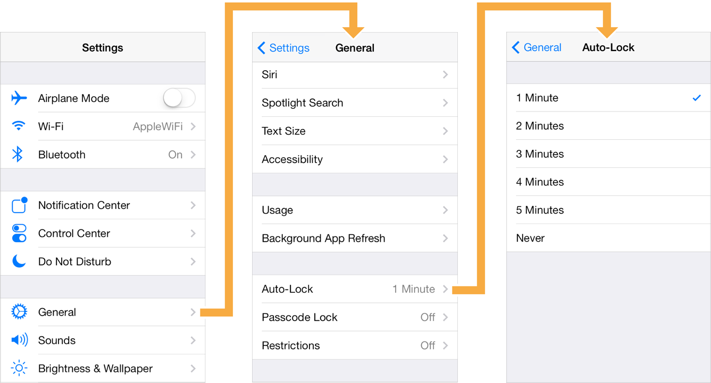

# 5.1. UIKit framework

### Noveo University — iOS


----

## Сегодня

* UIApplication, UIWindow, UIView, UILabel, UIButton
* UIViewController, UINavigationController
* Interface orientation
* Autolayouts
* Interface Builder


----

## UIKit

* Всё что видит пользователь:
  - текст,
  - кнопки,
  - картинки,
  - списки и д.р.
* Обработка действий пользователя:
  - нажатия,
  - жесты,
  - набор текста,
  - сворачивание/разворачивание приложения и д.р.
* Абстракции для работы с сущностями
  - цвет, шрифт,
  - устройство, экран, окно,
  - NIB, layouts и д.р.


----

## UIApplication

* Объект-синглтон `[UIApplication sharedApplication]`
* Владеет окном.
* Управляет статус-баром и иконкой.
* Управляет работой приложения в background-режиме.
* Рассылает уведомления о смене состояния приложения.
* Осуществляет переход в другие приложения (открывает URL).
* Имеет делегата.


----

## UIApplication

```ObjectiveC
UIApplication *app = [UIApplication sharedApplication];
	
NSURL *url = [NSURL URLWithString:@"http://google.com"];
if ([app canOpenURL:url]) {
	[app openURL:url];
}
```


----

## UIApplicationDelegate

* В каждом приложении есть класс реализующий этот протокол.
* Это место, с которого начинается исполнение прикладного кода.
* Обрабатывает события жизненного цикла приложения:
  - запуск,
  - сворачивание/разворачивание,
  - переход в активное/неактивное состояние (например звонок), 
  - переход в background-режим (приложение свёрнуто, но исполняется),
  - завершение работы приложения.
* Получает локальные и удаленные уведомления.


----

## UIApplicationDelegate

AppDelegate.h
```ObjectiveC
@interface AppDelegate : UIResponder <UIApplicationDelegate>

@property (strong, nonatomic) UIWindow *window;

@end
```

AppDelegate.m
```ObjectiveC
@implementation AppDelegate

- (BOOL)application:(UIApplication *)application 
	didFinishLaunchingWithOptions:(NSDictionary *)launchOptions {
    // Override point for customization after application launch.
    return YES;
}

@end
```


----

## UIScreen, UIWindow

Один экран<sup>*</sup>:
```ObjectiveC
[UIScreen mainScreen]
```

Одно окно<sup>*</sup>:
```ObjectiveC
[UIApplication sharedApplication].delegate.window
```
-----

<sup>*</sup> на самом деле — не совсем так.


----

## UIView

* Базовый класс для всего, что видит пользователь.
* Сама по себе `UIView` — просто прямоугольник.
* Умеет отрисовывать себя и перехватывать события внутри прямоугольника.
* Объекты `UIView` и его наследников выстраиваются в дерево:
  - `UIView` содержит 0 или несколько вложенных объектов — subview,
  - `UIView` имеет 0 или 1 объект-контейнер — superview,
  - `UIView` верхнего уровня лежит в окне `UIWindow`.


----

## UIView

```ObjectiveC
UIView *greenView = [[UIView alloc] init];
greenView.frame = (CGRect){200, 100, 60, 40};
greenView.backgroundColor = [UIColor greenColor];
[self.view addSubview:greenView];

UIView *redView = [[UIView alloc] init];
redView.frame = self.view.bounds;
redView.backgroundColor = [UIColor redColor];
[self.view insertSubview:redView atIndex:0];
```


----

## UIView

```ObjectiveC
UIView *greenView = [[UIView alloc] initWithFrame:(CGRect){200, 100, 60, 40}];
greenView.backgroundColor = [UIColor greenColor];
[self.view addSubview:greenView];

UIView *redView = [[UIView alloc] initWithFrame:greenView.bounds];
redView.backgroundColor = [UIColor redColor];
[self.view insertSubview:redView atIndex:0];
```


----

## UIView

```ObjectiveC
UIView *view = [[UIView alloc] initWithFrame:self.view.bounds];
view.hidden = NO;
view.alpha = 0.8f;
view.backgroundColor = [UIColor redColor];
view.userInteractionEnabled = YES;
view.tag = 42;

for (UIView *subview in view.subviews) {
	// do something with subviews
}

UIView *superview = view.superview;
// do something with superview
```


----

## UILabel

```ObjectiveC
UILabel *label = [[UILabel alloc] init];
label.frame = (CGRect) {0, 0, self.view.bounds.size.width, 30};
label.font = [UIFont systemFontOfSize:20];
label.backgroundColor = [UIColor clearColor];
label.textColor = [UIColor blackColor];
label.textAlignment = NSTextAlignmentLeft;
label.numberOfLines = 1;
label.adjustsFontSizeToFitWidth = YES;
label.minimumScaleFactor = 0.8f;
[self.view addSubview:label];
	
label.text = @"Hello, world!";
```


----

## UIImage, UIImageView

`UIImage` — картинка в памяти:
* загружается из файла / ресурсов / бинарных данных в памяти,
* сохраняется в JPG или PNG,
* поддерживает растягивание фонов / рамок,
* можно получить размер, ориентацию,
* автоматически выбирает версию ресурса (@1x, @2x, @3x).


----

## UIImage, UIImageView


`UIImageView` — картинка на экране:
* показывает `UIImage`,
* масштабирует до нужного размера (кадрирует / добавляет поля / растягивает / сжимает),
* поддерживает циклическую анимацию массива `UIImage`.


----

## UIImage, UIImageView

```ObjectiveC
UIImage *image = [UIImage imageNamed:@"my_image.png"];

UIImageView *imageView = [[UIImageView alloc] initWithImage:image];
imageView.frame = self.view.bounds;
imageView.contentMode = UIViewContentModeScaleAspectFit;
[self.view addSubview:imageView];
	
UIImage *image_2 = [UIImage imageNamed:@"my_image_2.png"];
imageView.image = image_2;
```


----

## UIButton как UIView

`UIButton` — кнопка с текстом, фоновой картинкой и иконкой.

```ObjectiveC
UIImage *buttonBGImageN = [UIImage imageNamed:@"button.png"];
UIImage *buttonBGImageS = [UIImage imageNamed:@"button_pressed.png"];
	
UIButton *button = [[UIButton alloc] init];
button.frame = (CGRect) {0, 0, 120, 40};
[button setTitleColor:[UIColor blackColor] forState:UIControlStateNormal];
[button setTitle:@"Tap me!" forState:UIControlStateNormal];
button.backgroundColor = [UIColor clearColor];
[button setBackgroundImage:buttonBGImageN forState:UIControlStateNormal];
[button setBackgroundImage:buttonBGImageS forState:UIControlStateSelected];
	
[self.view addSubview:button];
```


----

## UIButton как UIControl

`UIButton` — кнопка, реагирующая на *нажатие (tap)*

```ObjectiveC
UIButton *button = /* ... */;
[button addTarget:self
	action:@selector(buttonTap:)
	forControlEvents:UIControlEventTouchUpInside];
```

```ObjectiveC
- (void)buttonTap:(UIButton *)sender
{
	// ...
}
```


----

## UIControl

`UIControl` — наследник `UIView`, от которого в свою очередь наследуются контролы — элементы UI, принимающие и порождающие события.

```ObjectiveC
UIButton *button;
/*
 *	@[
 *		<target, action, events>,
 *		<target, action, events>,
 *		<target, action, events>,
 *		...
 *	]
 */
```

```ObjectiveC
[button addTarget:target action:action forControlEvents:events];
```


----

## UITextField

`UITextField` — однострочное редактируемое текстовое поле.

```ObjectiveC
self.label = [[UILabel alloc] initWithFrame:labelFrame];
[self.view addSubview:self.label];
	
self.textField = [[UITextField alloc] initWithFrame:inputFrame];
[self.view addSubview:self.textField];
[self.textField addTarget:self
	action:@selector(textChanged:)
	forControlEvents:UIControlEventEditingChanged];

// ...

- (void)textChanged:(UITextField *)sender
{
	self.label.text = sender.text;
}
```


----

## UIView

* `UIView` — логическая организация элементов (контейнер).
* `UILabel` — вывод текста.
* `UITextField`, `UITextView` — редактирование текста.
* `UIWebView` — отображение HTML.
* `UIImageView` — отображение картинок.
* `UIButton` — кнопка.
* `UISwitch`, `UISlider`, `UIStepper` — выключатель, регулятор, ступенчатый регулятор.
* `UIToolbar`, `UITabBar`, `UINavigationBar` — панели.
* `UIActivityIndicatorView` — спиннер.
* `UITableView`, `UITableViewCell` — список.
* `UICollectionView`, `UICollectionViewCell` — отображение коллекций.
* `UIScrollView` — область с прокрутки.
* `UIPickerView` — выбор варианта.


----

## UIColor

`UIColor` — представление цвета в одном из цветовых пространств.

RGB
```ObjectiveC
[UIColor colorWithRed:r/255.0f green:g/255.0f blue:b/255.0f alpha:a/255.0f];
```

HSV
```ObjectiveC
[UIColor colorWithHue:h/255.0f saturation:s/255.0f brightness:v/255.0f alpha:a/255.0f];
```

BW
```ObjectiveC
[UIColor colorWithWhite:w/255.0f alpha:a/255.0f];
```


----

## UIColor

Стандартные цвета
```ObjectiveC
[UIColor clearColor];
[UIColor blackColor];
[UIColor redColor];
...
```


----

## UIFont

`UIFont` — представление шрифта, характеризуется семейством, названием и размером.

Шрифт по имени
```ObjectiveC
[UIFont fontWithName:@"Helvetica-Bold" size:20];
```

Стандартный шрифт
```ObjectiveC
[UIFont systemFontOfSize:[UIFont systemFontSize]];
```


----

## UIFont

Список семейств шрифтов

```ObjectiveC
[UIFont familyNames]
```

* Courier
* Helvetica
* Helvetica Neue
* ...

Список вариантов начертаний

```ObjectiveC
[UIFont fontNamesForFamilyName:@"Helvetica"]
```

* Helvetica-Oblique
* Helvetica-Light
* Helvetica-Bold
* ...


----

## UIViewController

* Связывает модель с представлением.
* Управляет жизненным циклом своего view.
* Обрабатывает события (действия пользователя).
* Обеспечивает логическую организацию приложения (разбивка по экранам).

Как использовать:
* Создаётся класс-наследник от `UIViewController`.
* Поведение задаётся в переопределённых методах.
* Свойство `view` — верхнеуровневая `UIView` конроллера.


----

## UIViewController

```ObjectiveC
– initWithNibName:bundle:
– initWithCoder:
– viewDidLoad
– viewWillAppear:
– viewDidAppear:
– viewWillDisappear:
– viewDidDisappear:
– viewWillLayoutSubviews
– viewDidLayoutSubviews
– didReceiveMemoryWarning
...
```


----

## UIViewController

- `initWithNibName:bundle:` — designated initializer
- `initWithCoder:` — designated initializer
- `viewDidLoad` — `self.view` загружена
- `viewWillAppear:` — начало анимации перехода на экран
- `viewDidAppear:` — конец анимации перехода на экран
- `viewWillDisappear:` — начало анимации перехода с экрана
- `viewDidDisappear:` — конец анимации перехода с экрана
- `viewDidLayoutSubviews` — после изменения лейаута `view`


----

## UIViewController

```ObjectiveC
@interface DashboardVC : UIViewController
@property (nonatomic) float speed;
@end
```

```ObjectiveC
@interface DashboardVC()
@property (nonatomic) UILabel *speedLabel;
@end
 
@implementation DashboardVC
- (void)viewDidLoad
{
	[super viewDidLoad];
	
	self.speedLabel = [[UILabel alloc] initWithFrame:self.view.bounds];
	[self.view addSubview:self.speedLabel];
	
	[self refreshSpeed];
}
 
- (void)refreshSpeed
{
	self.speedLabel.text = stringFromSpeedValue(self.speed);
}
@end
```


----

## UIViewController

```ObjectiveC
@interface AppDelegate : UIResponder <UIApplicationDelegate>

@property (strong, nonatomic) UIWindow *window;

@end
```

```ObjectiveC
@implementation AppDelegate

- (BOOL)application:(UIApplication *)application
	didFinishLaunchingWithOptions:(NSDictionary *)launchOptions
{
	self.window = [[UIWindow alloc] initWithFrame:[UIScreen mainScreen].bounds];
	
	DashboardVC *dashboardVC = [[DashboardVC alloc] init];
	self.window.rootViewController = dashboardVC;
	
	[self.window makeKeyAndVisible];
	
	return YES;
}

@end
```


----

## UINavigationController

`UINavigationController` — VC-контейнер, управляющий иерархией переходов между своими дочерними VC.




----

## UINavigationController

```ObjectiveC
@implementation AppDelegate

- (BOOL)application:(UIApplication *)application
	didFinishLaunchingWithOptions:(NSDictionary *)launchOptions
{
	self.window = [[UIWindow alloc] initWithFrame:[UIScreen mainScreen].bounds];
	
	DashboardVC *dashboardVC = [[DashboardVC alloc] init];
	
	UINavigationController *nc = [[UINavigationController alloc]
		initWithRootViewController:dashboardVC];
	
	self.window.rootViewController = nc;
	
	[self.window makeKeyAndVisible];
	
	return YES;
}

@end
```


----

## UINavigationController

```ObjectiveC
@interface DashboardVC()

@property (strong, nonatomic) IBOutlet UIButton *settingsButton;

@end

@implementation DashboardVC

- (IBAction)settingsButtonTap:(UIButton *)sender
{
	SettingsVC *settingsVC = [[SettingsVC alloc] init];
	[self.navigationController pushViewController:settingsVC animated:YES];
}

@end
```


----

## Interface orientation

```ObjectiveC
@implementation DashboardVC
 
- (BOOL)shouldAutorotate
{
	return YES;
}

- (NSUInteger)supportedInterfaceOrientations
{
	return UIInterfaceOrientationMaskAll;
}

- (UIInterfaceOrientation)preferredInterfaceOrientationForPresentation
{
	return UIInterfaceOrientationPortrait;
}

@end
```


----

## Вёрстка интерфейса

* iPhone + iPad,
* portrait + landscape,
* динамический размер контента и другие случаи.


----

## Вёрстка интерфейса

* `UIView` содержит свойства
  - `CGRect frame`,
  - `CGRect bounds`,
  - `CGPoint center`.
* `frame` и `center` считаются в системе координат superview.
* `bounds` – геометрия view в её собственной системе координат.


----

## Вёрстка интерфейса

Система координат UIKit:
* `x` — слева направо, `y` — сверху вниз,
* единица измерения — pt.


----

## Вёрстка интерфейса

* Manual layout
  - Полный контроль.
  - Никакой автоматизации.
* Springs & struts (`UIViewAutoresizing`)
  - Легко освоить.
  - Удобно задавать и в IB и из кода.
  - Легко анимировать.
  - Легко кастомизировать.
  - Не помогает при динамическом контенте.
* Autolayout (`NSLayoutConstraint`)
  - Сложно освоить.
  - Неудобный редактор в IB и муторно задавать из кода.
  - Помогает при динамическом контенте.
  - Помогает при вёрстке под разные экраны.
  - Медленно работает.


----

## Manual layout

При каждом изменении геометрии view контроллера, вручную пересчитываем геометрию дочерних view.

```ObjectiveC
- (void)viewDidLoad
{
	[super viewDidLoad];

	self.myLabel = [[UILabel alloc] init];
	[self.view addSubview:self.myLabel];
}
 
- (void)viewDidLayoutSubviews
{
	[super viewDidLayoutSubviews];
	
	self.myLabel.frame = CGRectInset(self.view.bounds, 40, 40);
}
```


----

## Springs & struts

Задаём начальное положение subview и правила масштабирования относительно superview.

```ObjectiveC
- (void)viewDidLoad
{
	[super viewDidLoad];
	
	self.myLabel = [[UILabel alloc] init];
	[self.view addSubview:self.myLabel];

	self.myLabel.frame = CGRectInset(self.view.bounds, 40, 40);
	self.myLabel.autoresizingMask =
		UIViewAutoresizingFlexibleWidth |
		UIViewAutoresizingFlexibleHeight;
}
``` 


----

## Autolayouts

```ObjectiveC
- (void)viewDidLoad
{
	[super viewDidLoad];
	
	self.myLabel = [[UILabel alloc] init];
	[self.view addSubview:self.myLabel];

	self.myLabel.translatesAutoresizingMaskIntoConstraints = NO;
	UIView *label = self.myLabel;
	UIView *superview = self.view;
	NSDictionary *views = NSDictionaryOfVariableBindings(superview, label);
	
	[superview addConstraints:[NSLayoutConstraint
		constraintsWithVisualFormat:@"H:|-20-[label]-20-|"
		options:0 metrics:nil views:views]];

	[superview addConstraints:[NSLayoutConstraint
		constraintsWithVisualFormat:@"V:|-20-[label]-20-|"
		options:0 metrics:nil views:views]];
}
```


----

## Interface Builder

* XIB
  - работает с `UIView`,
  - визуальное описание иерархии и свойств view,
  - привязка свойств (`IBOutlet`),
  - привязка action-методов (`IBAction`),
  - привязка внешних объектов.
* Storyboard
  - работает с `UIViewController`,
  - несколько экранов в одном файле,
  - можно описать переходы между экранами,
  - таблицу можно описать вместе с ячейками,
  - статические таблицы.


----

## Interface Builder

Следует очень аккуратно использовать Storyboards:
* Большие файлы тормозят во время редактирования.
* Большие файлы очень трудно мёржить.
* Привносится множество проблем с идентификаторами.
* Нельзя работать с отдельно взятым `UIView`.


----

## Interface Builder

XIB
```ObjectiveC
MyVC *myVC = [[MyVC alloc] initWithNibName:@"MyVC" bundle:[NSBundle mainBundle]];

// При совпадении имени файла с именем класса допустимо его опускать
// MyVC *myVC = [[MyVC alloc] init];
```

Storyboard
```ObjectiveC
UIStoryboard *myStoryboard = [UIStoryboard storyboardWithName:@"MySB"
	bundle:[NSBundle mainBundle]];

MyVC *myVC = [myStoryboard instantiateViewControllerWithIdentifier:@"MyVC"];
```


----

## Interface Builder

```ObjectiveC
@interface MyVC ()

@property (nonatomic) IBOutlet UIButton *myButton;
@property (nonatomic) IBOutletCollection(UILabel) NSArray <UILabel *> *myLabels;

@end

@implementation MyVC

- (IBAction)myButtonTap:(UIButton *)sender
{
	for (UILabel *label in self.myLabels) {
	    label.text = nil;
    }
}

@end
```


