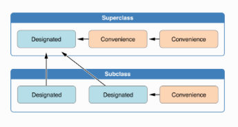

# 1. Введение в Swift. Часть 1

### Noveo University — iOS


----
## Структура программы

* отсутствуют заголовочные файлы
* нет явного разделения интерфейса и реализации, вся информация о классах, функциях и константах находится в единственном `*.swift` файле.
* любой `Objective-C` фреймворк или `C` библиотека может быть импортирована напрямую в `Swift` проект. Это включает все системные фреймворки

```swift
import Foundation
```
Note: После такого импорта в свифт файле будут доступны все классы, протоколы, функции и константы из фреймворка Foundation.


----
## Примитивы
<!-- Слайд для напоминания синтаксиса --->

```swift
	let x = 1 // Int
	let d = 1.0 // Double
	let f: Float = 1 // Float
	let s = "example" // String
	var result = "example" + String(x) // example 1
	result = "\(s) \(x * 2)" // example 2
	let enclosedEAcute: Character = "\u{E9}\u{20DD}" // é⃝
	
	/* multiline example */
	let multiline = """
		This is a test example
			of the multiline string
		"""
```
```swift
	func print(_ items: Any..., 
				separator: String = default, 
			 	terminator: String = default)
	
	let one = "1"; let two = "2"; let three = "3" // semicolon between statements
	
	print(one, two, three) // prints 1 2 3\n
	print("1", "2", "3", separator: ".", terminator: "!") // prints 1.2.3!
```

Note: 
Swift String использует встроенные юникод-скаляры, которые являются 21-битными числами. Например, U+0061 - маленькая латинская a. 
юникодные скаляры в интервалах U+0000 - U+D7FF и U+E000 - U+10FFFF 
суррогатные пары в интервале U+D800 - U+DFFF 
остальные зарезервированы на будущее

Каждому Character сопоставлен единственный расширенный графемный кластер, который по сути является одним или несколькими юникодными скалярами (скомбинированными)

Рассказать про строки, characters и кластеры. Почему string.count - это не то, что кажется. Кластеры могут складываться

var cafe = "cafe" // cafe.count = 4

cafe += "\u{301}" // café => cafe.count = 4

Описание работы с функцией вывода в лог


----
## Числовые типы данных

У базовых числовых типов данных определены границы допустимых значений
```swift
	let min = UInt8.min // 0
	let max = UInt8.max // 255
```
В большинстве случаев вам не понадобится указывать конкретный размер для целого числа. Для этого случая в `Swift` определëн тип `Int`, который по размеру равен разрядности операционной системы. 

Note: 
Обратить внимание, что это может быть источником проблем на старых устройствах с 32-разрядным Int, в который могут не влезть данные


----
## Числовые типы данных
Для операций с вещественными числами определены типы 
* `Float` (32 бита, 6 цифр после запятой);
* `Double` (64 бита и как минимум 15 цифр после запятой).

Для удобства преобразований
```swift
	let million = 1_000_000
	let overMillion = 1_000_000.000_000_1
	
	let binary = 0b11001 // 25 в двоичной системе счисления
	let octal = 0o31 // 25 в восьмиричной
	let hex = 0x19 // 25 в шестнадцатеричной
	let exp1 = 1.5e3 // 1500
	let exp2 = 1.5e-3 // 0.0015
	let hExp1 = 0x11p4 // 17 * 2^4 = 272
	let hExp2 = 0x11p-4 // 17 * 2^(-4) = 1.0625
```


----
## Выход за пределы

```swift
	let notNegative: UInt8 = -1
	// Negative integer '-1' overflows when stored into unsigned type 'UInt8'
	
	let tooBig: Int8 = Int8.max + 1
	// Arithmetic operation '127 + 1' (on type 'Int8') results in an overflow
```

Решить можно двумя способами. 
* Либо определять тип результата таким образом, чтобы в него явно помещалось итоговое значение
```swift
	let variable: Int16 = Int8.max + 1
```
* Либо использовать безопасные операторы
```swift
	let variable: UInt8 = UInt8.max &+ 2 // 1
```


----
## Кортеж (Tuple)
В `Swift` встроена возможность создания анонимного типа данных простым объединением нескольких типов в одну группу. Например
```swift
	let http404Error = (404, "Not Found")
	let (justCode, _) = http404Error
	let http200Status = (statusCode: 200, description: "Ok")
	print(http200Status.statusCode)
```
Для удобства любому кортежу можно назначить имя 
```swift
	typealias Void = ()
	typealias HttpResponseStatus = (statusCode: UInt16, description: String)
```
Если ваша структура данных будет использоваться за пределами какой-то малой области логики, то используйте полноценные структуры и классы вместо кортежей.

Note: 
является value-type. Нельзя создать из одного элемента.


----
## Коллекции. Массив
```swift
	// Array<Element>
	let array = ["cat", "dog"]
	let emptyArray = Array<String>()
	var emptyArray2: [String] = []
	emptyArray2[0] = "some"
	emptyArray2.removeFirst()
	
	var repeating = Array(repeating: 0, count: 10) //0000000000
	repeating[3...8] = [1, 1] // 000110
	// 3...8  CountableClosedRange<Int>
	// 3..<9  CountableRange<Int>
	
	let sum = ["woman"] + ["man"] // ["woman", "man"]
```
* Определëн как обобщëнная коллекция (generic)
* Является value-type
* Объявляйте через `let` когда возможно (простота и оптимизация)
Note: 
Обратить внимание, что emptyDictionary2 – переменная, т.к. потом изменяется


----
## Коллекции. Словарь
```swift
	// Dictionary<Key, Value>; Key must be Hashable
	let dictionary = ["key1": 7, "key2": 14, "key3": 21]
	let emptyDictionary = Dictionary<String, Int>() 
	var emptyDictionary2: [String: Int] = [:]
	emptyDictionary2["key"] = 0
	let old = emptyDictionary2.removeValue(forKey: "key")
```
* Определëн как обобщëнная коллекция (generic)
* Является value-type
* Элементы не упорядочены
* Объявляйте через `let` когда возможно (простота и оптимизация)

Note: 
Рассказать о хэш-таблице и о Hashable 
Что можно использовать любой свой тип данных как значение ключей словаря или как содержимое множества, которое будет на следующем слайде. Для этого в Swift определен протокол Hashable
public protocol Hashable : Equatable {
    /// Hash values are not guaranteed to be equal across different executions of
    /// your program. Do not save hash values to use during a future execution.
    public var hashValue: Int { get }
}
public protocol Equatable {
    /// Equality is the inverse of inequality. For any values `a` and `b`,
    /// `a == b` implies that `a != b` is `false`.
    ///
    /// - Parameters:
    ///   - lhs: A value to compare.
    ///   - rhs: Another value to compare.
    public static func ==(lhs: Self, rhs: Self) -> Bool
}


----
## Коллекции. Множество
```swift
	// Set<Element>; Key must be Hashable
	
	let emptySetOfChar = Set<Character>()
	
	var setOfInt: Set<Int> = [0, 3, 2, 99]
	setOfInt.insert(1)
	let contains = setOfInt.contains(99)
	let removed = setOfInt.remove(10)
```
* Определëн как обобщëнная коллекция (generic)
* Является value-type
* Элементы не упорядочены
* Объявляйте через `let` когда возможно (простота и оптимизация)


----
## Коллекции. Операции над множествами
Пересечения
```swift
	let odd: Set = [1, 3, 5, 7, 9]
	let even: Set = [0, 2, 4, 6, 8]
	let prime: Set = [2, 3, 5, 7]
	
	odd.union(even) // 0...9
	odd.intersection(even) // empty
	odd.subtracting(prime) // 1, 9
	odd.symmetricDifference(prime) // 1, 2, 9
```
Принадлежность
```swift
	func isSubset(of:) // проверка является ли подмножеством
	func isSuperset(of:) // проверка является ли надмножеством
	func isStrictSubset(of:) // проверка является ли подмножеством и не равно
	func isStrictSuperset(of:) // проверка является ли надмножеством и не равно
	func isDisjoint(with:) // проверка на отсутствие общих элементов
```


----
## Перечисления
```swift
	enum Some {
		case first, second // можно через запятую
		case third
	}
	
	let some = Some.second
	switch some {
		case .first: 
			fallthrough
		case .second: 
			print("first or second")
		default:
			break
	}
	
	enum Digit: Int {
		case zero = 0, one, two, five = 5, six, seven
	}
	let five = Digit(rawValue: 5) // Optional<Digit>
	print(Digit.six.rawValue) // 6
```
* Является value-type
* Поддерживает `Hashable` в указанном виде

Note: 
перечисления определяют общий подход к объявлению группы связанных значений как тип данных, что позволяет вам работать с этими значениями в условиях жесткой типизации.
Далее синтаксис - показать какие возможны варианты
ОТМЕТИТЬ, что switch должен всегда покрывать все возможные случаи
Если кто знает C - в свифт по умолчанию нет целочисленного сопоставления каждому кейсу. Если разработчик всё же этого хочет, то делать надо как в примере с Digit. Могут быть строки, символы или любые целочисленные\вещественные типы данных. Конечно же, каждое rawValue должно быть уникальным для enum. Иначе ошибка компиляции Raw value for enum case is not unique


----
## Перечисления. Ассоциированные значения
```swift
enum Barcode {
	case upc(Int, Int, Int, Int)
	case qr(String)
}
```
```swift
switch code {
	case let .upc(system, manufacturer, product, check):
		print(system, manufacturer, product, check)
	case .qr(var productCode):
		print(productCode)
}
if case let .qr(productCode) = code { /* ... */ } 

let barcodes: [Barcode] = // Some array of barcodes
for case let .qr(productCode) in barcodes {
	print(productCode)
}
```
* Не поддерживает `Hashable`
Note:
Показать возможные места для let\var
Порой полезно иметь ещё какие-то приписанные значения для случаев перечислений, чтобы удобнее реализовывать логику ветвлений.


----
## Рекурсивный перечисления
В случае если ваше перечисление содержит некоторые случаи, которые содержат в качестве ассоциированного значения объект того же перечисления, то необходимо использовать `indirect`

```swift
indirect enum ArithmeticExpression {
	case number(Int)
	case add(ArithmeticExpression, ArithmeticExpression)
}

func calculate(exp: ArithmeticExpression) -> Int {
	switch exp {
		case let .number(value):
			return value
		case let .add(first, second):
			return calculate(exp: first) + calculate(exp: second)
	}
}
```


----
## Перечисления. Ассоциированные значения
Чтобы сделать работу с перечислениями ещë более удобной в `Swift` реализован механизм Pattern Matching.
```swift
	enum NumberExpression {
		case sum(Int, Int)
		case subtract(Int, Int)
	}
	
	func calculate(numberExpression: NumberExpression) -> Int {
		switch numberExpression {
			case let .sum(first, second) where first == second:
				return 2 * first
			case let .sum(first, second):
				return first + second
			case let .subtract(first, second):
				return first - second
		}
	}
```
```swift
	for case let .qr(productCode) in barcodes where productCode.contains("QWE") {
		print(productCode)
	}
```


----
## Optional
В `Swift` реализована обработка ситуацией отсутствия значения на уровне компиляции. Для этого определëн тип
```swift
	enum Optional<Wrapped> {
		case none
		case some(Wrapped)
	}

	var integer: Int? // default value is none
	var another: Optional<Int> = 5
	
	// Оператор ! разворачивает содержимое, но это небезопасно - runtime error
	print(another!) 
	
	if let unwrapped = integer {
		print(unwrapped) // unwrapped имеет тип Int
	}
	
	integer?.hashValue // optional chaining
	var someVariable: [Int!] //  compile error. Почему?
```

Note:
* fatal error в случае nil!. Также обратить внимание, что нельзя с пробелом написать `another !`
* [Int!] //  compile error потому, что ! - это особенность декларации объекта и не является типом (тип - Optional). То есть это привязка к имени, а потому может быть написана только на верхнем уровне и никаких вложений 
Ну и вообще рассказать, что такая декларация используется только в тех случаях, когда по коду программы очевидно, что здесь точно не будет nil. И именно для удобства, чтобы каждый раз не делать проверку на nil. По сути это обычные optional и с ними можно делать все те же операции


----
## Optional. nil
В `Swift` для обозначения отсутствия значения у переменной используется ключевое слово `nil`. Работает это с помощью
```swift
	protocol ExpressibleByNilLiteral {
	    /// Creates an instance initialized with `nil`.
	    public init(nilLiteral: ())
	}
```
Только тип `Optional` соответствует `ExpressibleByNilLiteral`. Соответствие `ExpressibleByNilLiteral` для типов, использующих `nil` для других целей, не рекомендуется.
```swift
	var variable: Int? = nil // .none
```


----
## Поток управления, проверка условий

```swift
	if condition {
		// condition is true
	} else if condition2 {
		// condition is not true, condition2 is true
	} else {
		// condition and condition2 are both false
	}
	
	guard condition3 else {
		// condition3 is not true in else block
		return // break | continue | throw
	}
	
	switch someInteger {
	case 0:
		fallthrough
	case 1..<5:
		break
	default:
		break
	}
```


----
## Поток управления, циклы

```swift
	for i in 0...9 {
	}
	while condition {
	}
	
	repeat {
	} while condition
```
* Возможны ситуации, когда внутри цикла (или проверки) вы имеете вложенные циклы и/или проверки, которые должны влиять на работу внешнего блока. Для этого предусмотрена возможность выдачи имени

```swift	
	loopName: for (key, value) in dictionary.enumerated() {
		switch value {
			case .stop:
				break loopName
			case .continue:
				continue loopName
			default: 
				break
		}
		// some logic
	}	
```


----
## Функции

* Помогают структурировать код 
* Облегчают понимание логики работы программы
* Переиспользование 
* Бывают глобальные, объектные и анонимные

Note:
Каждая функция имеет свой специальный тип, состоящий и типов параметров и типа возвращаемого значения


----
## Функции, синтаксис

```swift
	func f1(param1: Int, param2: Int) -> Int { return 0 }
	let _ = f1(param1: 0, param2: 0)
	
	func f2(_ param1: Int, param2: Int = 12) -> (Int, Bool) { return (0, false) }
	let _ = f2(0, param2: 0) // or
	let _ = f2(0)
	
	func f3(external1 param1: Int, external2 param2: Int) {}
	f3(external1: 0, external2: 0)
	
	// Можно передать >= 0 значений, в функции максимум 1 такой параметр 
	func f4(numbers: Double...) {} 
	f4(numbers: 1, 2, 3) // or
	f4(numbers: 1, 2, 3, 4, 5.5, 6)
	
	func swap(_ a: inout Int, _ b: inout Int) {}
	var var1 = 0; var2 = 1
	swap(&var1, &var2)
	
```
Note:
1. inout не может иметь дефолт значение, переменный по количеству значений параметр не может быть inout 
2. inout работает по принципу скопировали сначала, поработали, скопировали обратно


----
## Функции, синтаксис
```swift
	func changeByOne(increase: Bool) -> (Int) -> Int {
		func incrementFunc(value: Int) -> Int { return value + 1 }
		func decrementFunc(value: Int) -> Int { return value - 1 }
		
		return increase ? incrementFunc : decrementFunc
	}
```
```swift
	func f1(closure: @escaping () -> Void)  {
		OperationQueue.main.addOperation(closure)
	}
	
	func f2(closure: () -> Void)  {
		closure()
	}
	
	class Person {
		var age = 20
		
		func life() {
			f1(closure: {
				self.age = 21
			})

			f2(closure: {
				age = 21
			})
		}
	}
```
Note:
Можно объявлять вложенные функции, но проще использовать closure

В примере жизни показана разница для @escaping - closure передан в функцию параметром, но вызывается уже после завершения функции. Такая аннотация нужна для того, чтобы сказать компилятору, что данная closure может высвободится за рамки функции. Добавить пример словами - передать closure и сохранить её как свойство класса. После того, как такая аннотация добавлена в сигнатуре функции, то при вызове вы должны явно указывать `self` объект, потому что на момент вызова неясно будет к кому обращаться


----
## Closures
Замыкания могут захватывать и хранить ссылки на любые константы и переменные из контекста, в котором они определены. Функции, описанные перед этим, являются по сути специальными случаями замыканий.

* Глобальная функция - замыкание, которое имеет имя и не захватывает значения
* Вложенная функция - замыкание, которое имеет имя и может захватывать значения из содержащей еë функции
* Closure - анонимное замыкание, которое может захватывать значения из окружения
<!-- тут я написал по англ чтобы разнести смысл определений. Слева (closure) - конструкция языка, а справа еë определение -->


----
## Closures, синтаксис
```swift
	reversed = strings.sorted(by: { (s1: String, s2: String) -> Bool in
		return s1 > s2
	})
	
	reversed = strings.sorted(by: { (s1: String, s2: 
			String) -> Bool in return s1 > s2 } ) // написано на одной строке
	
	reversed = strings.sorted(by: { s1, s2 in return s1 > s2 } ) // вывели типы
	
	reversed = strings.sorted(by: { s1, s2 in s1 > s2 } ) // отбросили return
	
	reversed = strings.sorted(by: { $0 > $1 } ) // алиас для аргументов
	
	reversed = strings.sorted() { $0 > $1 } // trailing closure
	
	reversed = strings.sorted { $0 > $1 } // пустые скобки можно убрать
	
	reversed = strings.sorted(by: >) // > - это оператор - функция
```

Note:

```swift
	{ (parameters) -> returnType in
		statements
	}
```

Параметры
1. могут быть inout
2. могут быть с переменные количеством значений, если указано имя
3. могут быть кортежами


ключевое слово in означает конец декларации параметров и возвращаемого значения, и тем самым служит началом определения тела замыкания


----
## Closures, захват значений
* Вложенная функция - замыкание, которое имеет имя и может захватывать значения из содержащей еë функции
```swift
	func increment(amount: Int) -> () -> Int {
		var total = 0
		func incrementNestedFunc() -> Int {
			total += amount
			return total
		}
		return incrementNestedFunc
	}
	
	let f = increment(amount: 10)
	print(f()) // 10
	print(f()) // 20
	
	let f2 = increment(amount: 10)
	let f3 = f
	print(f2()) // 10
	print(f3()) // 30, reference type
```


----
## Классы и структуры

* Имеют свойства для хранения значений
* Имеют методы для предоставления функциональности
* Имеют конструкторы - возможность инициализации
* Могут быть расширены по функциональности
* Могут реализовывать протоколы (следовать контрактам)
###Только классы:
* Наследование
* Преобразование типа в рантайме (type casting)
* Деинициализация (можно освободить ресурсы доп.логикой)
* Подсчëт ссылок - один и тот же объект доступен в нескольких местах

Note:
Рассказать ref & value types 

Начать рассказ с того, что такое структура на примере числа. Есть число, ты с ним работаешь и оно прямо у тебя рядом. Ты меняешь число и оно полностью меняется. Становится другим. А с классом немного по другому. Это та же структура, только лежит где-то там, в куче. И чтобы с ней работать тебе выдаëтся ссылка. Ссылка это как структура. Вот она у тебя есть и если ты еë поменяешь, то поменяется всë. Но объект по ссылке останется нетронутым. 

Размышления на тему когда что использовать. Как общую рекомендацию для структур можно привести
1. объединение нескольких простых значений
2. поля сущности в основном value-type (поскольку мы ожидаем, что будет копирование происходить. так пусть копируется)
3. не нужно никакое наследование (свойств и поведения) от других типов


----
## Классы и структуры, синтаксис

```swift
	struct HumanMeasure {
    var weight: Float = 0
    var height: Float = 0
	}
	/* HumanMeasure(), HumanMeasure(weight: 90, height: 190) */
	
	class Person {
	    var measure = HumanMeasure()
	}
	
	let man = Person()
	var value = man.measure
	value.weight = 90
	print(man.measure.weight) // 0.0
	
	let manRef2 = man
	manRef2.measure = HumanMeasure(weight: 90, height: 190)
	print(man.measure.height) // 190.0
```
Note:
рассказать, что все поля должны иметь значение по умолчанию, если без инита


----
## Классы и структуры, свойства

```swift
	class Person {
		private var measure = HumanMeasure() // stored property
		var weight: Float { // computed property
			get {
				return measure.weight
			}
			set { // or set(newWeight)
				measure.weight = newValue
			}
		}
		var age = 0 {
			willSet { // or willSet(newAge)
				print(newValue)
			}
			didSet { // or didSet(oldAge)
				print(oldValue)
			}
		}
		lazy var child = Person()
		static var personsNumber = 0
	}	
```
Note:
Ленивые проперти всегда объявляются как переменные, потому что все константы (объявленные как let) должны иметь значение ДО завершения процесса инициализации, что нарушается в случае ленивых свойств.

Процесс инициализации lazy не является потокобезопасным.

Вычисляемые свойства тоже помечаются как переменные, т.к. нет гарантии, что они всегда будут возвращать константное значение.

К слову о ленивой инициализации - все глобальные константы и переменные всегда вычисляются лениво, то есть по требованию. Чего не скажешь о локальных константах и переменных, которые всегда вычисляются в момент объявления. Такое поведение глобальных переменных схоже с поведением свойств типа данных (static var\let)


----
## Классы и структуры, методы
```swift
	struct Counter {
		private(set) var number = 0
		
		@discardableResult
		mutating func increment(by number: Int) -> Int { 
			self.number += number 
			return self.number
		}
		
		mutating func reset(to number: Int) {
			self = Counter(number: number)
		}
		
		static func print(counter: Counter) {
			print("The number is ", counter.number)
		}
	}
```
Note:
static - нельзя переопределить в наследниках классов
class - можно 

Рассказать про self	- неявное свойство объекта, которое является точным эквивалентом объекта. Используется для обращения к текущему экземпляру во внутренних методах. Уточнить, что не надо всегда писать self, Swift это делает по умолчанию (предполагает, что вы обращаетесь к внутреннему свойству или методу).

Про mutating: по умолчанию свойства value-type не могут быть изменены внутри методов, но если хочется..

Type method: self указывает на сам класс.


----
## Классы и структуры, subscript

```swift
class Vector {
    private var components = [Double]()
    init(dimension: Int) {
        components = Array(repeating: 3.0, count: dimension)
    }
    
    subscript(index: Int) -> Double {
        get {
            return components[index]
        }
        set {
            components[index] = newValue
        }
    }
}

let v = Vector(dimension: 2)
v[0] = 5
print(v[0]) // 5
print(v[1]) // 3
```
Может принимать любое количество параметров любого типа 
Note:
используется для быстрого и удобного предоставления доступа к элементам коллекции, списка или какой-либо последовательности.

могут быть read-write могут read-only.


----
## Наследование

* Доступно только для классов.
* Нет множественного наследования.
* Нет универсального базового класса.

```swift
	class Shape {
		var corners = [Point]()
		func perimeter() -> Double {
			// ...
		}
	}
	
	class Square: Shape {
		override var corners = [Point]() { // get set?
			didSet {
				side = // calculate from corners value
			}
		}
	
		var side: Double = 0
		override func perimeter() -> Double {
			return 4 * side
		}
	}
```

* Пометка `final` запрещает возможность переопределения.

Note:
1. Также override возможен для свойств, чтобы определить свои геттеры и сеттеры, или добавить обсерверы на изменение.
2. Переопределяем сеттер - обязаны переопределить геттер. Не хотим? делаем return super.thisProperty


----
## Инициализация

Процесс подготовки объекта класса, структуры или перечисления к использованию. Включает в себя установку стартовых значений для всех хранимых свойств (обязательное требование на конец инициализации), а также выполнение каких-нибудь дополнительных необходимых операций.
```swift
	class Some {
		var i = 0
		var b: Bool
		var title: String? // default is nil
		
		init() { // могут быть разные параметры
			i = false
		}
		
		init(b: Bool) {
			self.b = b
		}
	}
```
Note:
1. Выставление значения свойству в инициализаторе\дефолтном значении не приводит к вызову обсерверов
2. Использование дефолт значения лучше, так как сокращает код, делает установку значения ближе к объявлению, позволяет неявно определить тип данных, а также позволяет по полной воспользоваться дефолтным инициализатором и наследованием инициализаторов. Использовать, когда свойство всегда принимает одно и то же значение при создании экземляра


----
## Инициализация
<!-- Пример создания с помощью разных инициализаторов -->
```swift
	func normalize(color: Double) -> Double {
		return max(0, min(1, color))
	}
	
	struct Color {
		let red, green, blue: Double
		
		init(red: Double, green: Double, blue: Double) {
			self.red = normalize(color: red)
			self.green = normalize(color: green)
			self.blue = normalize(color: blue)
		}
		init(white: Double) {
			self.red = normalize(color: white)
			self.green = normalize(color: white)
			self.blue = normalize(color: white)
		}
	}
	
	let yellow = Color(red: 1, green: 1, blue: 0)
	let lightGray = Color(white: 0.8)
```


----
## Инициализация

Если в структуре или классе определены значения по умолчанию для всех свойств, и при этом не определëн ни один инициализатор, то `Swift` предоставляет инициализатор по умолчанию (default initializer).

```swift

	class Object {
		var someString = "some string"
	}
	
	let object = Object()
	
```


----
## Инициализация структур
Если в структуре определены значения по умолчанию для всех свойств, и при этом не определëн ни один инициализатор, то `Swift` предоставляет инициализатор по всем свойствам (memberwise initializer).

```swift
	struct Point {
		var x = 0.0, y = 0.0
	}
		
	// как обмануть и определить свои инициализаторы:
	extension Point {
		init(ox: Double) {
			self.x = ox
		}
	}
	
	let a = Point()
	let b = Point(x: 1, y: -1.23)
	let c = Point(ox: 12)
```


----
## Назначенный инициализатор класса

* Designated initializer (DI) – главный, основной инициализатор для класса. 
* Каждый класс должен иметь как минимум один DI.
* Может быть несколько у одного класса.
* Является обязательным шлюзом, через который проходит процесс инициализации объекта перед тем, как уйти вверх по иерархии класса. К этому моменту должны быть проинициализированы **все** свойства объекта.


----
## Назначенный и вспомогательный инициализаторы класса

```swift
	class SomeObject {
		let n: Int
		
		init(number: Int) {
			self.n = number
		}
		
		convenience init(bool: Bool) {
			let number = bool ? 100 : 0
			self.init(number: number)
		}
	}
```


----
## Делегирование инициализации

**Правило 1:** DI класса должен вызывать DI своего непосредственного класса-родителя.

**Правило 2:** Вспомогательный инициализатор должен вызывать другой инициализатор того же класса.

**Правило 3:** Вспомогательный инициализатор в конечном итоге должен вызвать назначенный инициализатор того же класса.



Note:
Инициализация разбивается на две фазы
Фаза №1: проставление начальных значений всех свойствам объекта
Фаза №2: Донастройка объекта

Компилятор делает дополнительные проверки на что, чтобы программист всë верно сделал в инициализации
1. проверяет, что все свойства конкретного класса проинициализированы перед вызовом родительского инициализатора
2. DI должен делегировать инициализацию к родителю перед тем, как пользоваться и менять отнаследованные свойства. (иначе перезатрëт). Так что компилятор плюëт ошибками.
3. вспомогательный инициализатор должен делегировать инициализацию до того, как присвоит какое-либо значение в свойство класса (иначе перезатрëт). Так что компилятор плюëт ошибками.
4. Инициализатор не может вызвать никакие методы, прочитать значение свойств или просто обратиться к self, пока не закончится Фаза №1.


----
## Наследование инициализаторов

* Чтобы переопределить инициализатор необходимо, как и в остальных случаях, использовать ключевое слово `override`
```swift
	class Child: Parent {
		override init() {
			super.init()
		}
	}
```
* Дочерние классы **не** наследуют инициализаторы родителя автоматически.
* Существует два правила наследования инициализаторов:
	1. Дочерний класс не определяет собственных DI - получает DI родителя
	2. Дочерний класс либо реализует все DI родителя либо удовлетворяет первому правилу – тогда дочерний класс получает доступ к использованию всех вспомогательных инициализаторов класса-родителя.


----
## Негарантированный инициализатор

* Инициализатор не возвращает значение. Его задача удостовериться, что объект верно сконфигурирован.
* Порой случается, что нет возможности корректно подготовить объект к работе. Например, создать целое число по строке `"not a number"`.
```swift
	class SomeObject {
		init?(number: Int) { // yes, you can write init!
			if number % 2 == 0 {
				return nil // trigger an initialization failure
			}
		}
	}
```
* Можно переопределить при наследовании в гарантированный, но не наоборот.


----
## Негарантированный инициализатор перечислений
```swift
	enum Temperature {
		case kelvin, celsius, fahrenheit
		init?(char: Character) {
			switch char {
				case "K": self = .kelvin
				case "C": self = .celsius
				case "F": self = .fahrenheit
				default: return nil
			}
		}
	}
	let t = Temperature(char: "C") // t has Optional<Temperature> type
```
Можно с помощью средств `Swift`:
```swift
	enum Temperature: Character {
		case kelvin = "K", celsius = "C", fahrenheit = "F"
	}
	let t = Temperature(rawValue: "C") // t has Optional<Temperature> type
```


----
## Уничтожение объекта

* Деинициализатор вызывается непосредственно перед уничтожением объекта.
```swift
	deinit {
		// Ваши действия
	}
```


----
## Протоколы
* Наряду со структурами, перечислениями и классами в `Swift` существует тип данных `protocol`. 
* С его помощью можно налагать контрактные обязательства.
* Не может быть создан непосредственный экземпляр, однако можно работать с другими объектами под видом протокола (если их тип данных ему удовлетворяет).
* Можно реализовывать сразу несколько протоколов

```swift
	protocol SomeProtocol {
		var variable: Bool {get set}
		func f()
	}
	
	struct Example: SomeProtocol {
		var variable = false
		func f() {
			// do nothing
		}
	}
```
Note:
	Рассказать какие могут быть написаны требования в протоколах
	1. свойства гет сет; static\class, не static\class
	2. функции static\class, не static\class
	3. subscript-ы
	4. mutating для value type. Если реализует класс, то писать не надо
	5. инициализаторы - можно как DI можно как convenience. Но в любом случае реализацию надо будет пометить как required. С такой помощью данный инициализатор будет у всех потомков либо по наследованию либо по непосредственному переопределению, и таким образом протокол будет выполняться.
	6. Если класс final, то помечать инициализаторы из протокола как обязательные не надо. Всë равно наследоваться некому


----
## Расширения
* Позволяет добавить новую, но не может перегрузить имеющуюся функциональность у любых уже существующих типов данных.
* Нельзя добавить хранимые свойства
* Позволяет элегантно реализовать поддержку протокола.
```swift
	class A { var x = 0 }

	protocol P {
	    func calculate() -> Int
	    func function()
	}
	
	extension P {
	    func function() {} // default implementation
	}
	
	extension A: P {
	    func calculate() -> Int { return x }
	}
```

Note: Позволяет добавить новую:
1. вычисляемые свойства
2. классовые и объектные методы
3. инициализаторы
4. сабскрипты
5. доопределить новые вложенные типы


----
## Обработка ошибок
* В `Swift` ошибками могут быть любые типы, которые следуют пустому протоколу `Error`
```swift
	enum SomeError: Error {
		case mistake(Int)
		case incorrectFlow
		case unknownError
	}
```
* С помощью выбрасывания ошибки вы можете корректно обработать случаи неверного хода работы программы
```swift
	func generateOddNumber() throws -> Int {
		let number = Int(arc4random())
		if number % 2 == 0 {
			throw SomeError.incorrectFlow
		}
		return number
	}
```
* Не запускает раскрутку стека (поиск способного к обработке ситуации блока `catch`)


----
## Обработка ошибок
```swift
	do {
		let n = try generateOddNumber()
		print(n)
	} catch SomeError.incorrectFlow {
	    print("It's generated even number")
	} catch let SomeError.mistake(mistakeNumber) where mistakeNumber % 5 != 0 {
	    print("mistake", mistakeNumber)
	} catch {
	    print(error.localizedDescription) // error provided by Swift
	}
```
Либо можно воспользоваться `Optional chaining`
```swift
	let n = try? generateOddNumber() // n has Optional<Int> type
	let n2 = try! generateOddNumber() // n has Int type
```


----
## Приведение типов
* Данный механизм позволяет:
	1. Проверить тип объекта
	2. Начать работу с ним под видом какого-то другого типа его иерархии
	3. Проверить следует ли тип данных указанному протоколу
* Два оператора **`is`** и **`as`**
	1. is - проверка для дочерних классов или протоколов
	2. as? - безопасное преобразование к указанному типу данных
	3. as! - небезопасное


----
## Приведение типов
* В `Swift` определено два специальных типа данных для возможности работы с неспецифицированными типами:
	1. **`Any`** может представлять объект любого типа (даже функции)
	2. **`AnyObject`** может использоваться как тип конкретного объекта произвольного класса, классовый тип или как классовый протокол.

```swift
	// Swift lib:
	@objc public protocol AnyObject {}
	/********************************/
	
	protocol ExampleType: class { }
	class Example: ExampleType { }
	
	let er = Example()
	let ep: ExampleType = Example()
	let a1: AnyObject = er
	let a2: AnyObject = Example.self
	let a3: AnyObject = ep
```

* Используйте данные типы только когда действительно этого хотите, ведь вы лишаетесь интерфейса нужных типов и проверок компилятора.

Note:
Если протокол тут бы был без ограничения на класс
protocol ExampleType { }
то была бы ошибка 
value of type 'ExampleType' does not conform to specified type 'AnyObject'

Так же AnyObject может быть использован как конкретный тип для объектов сбриджованных от обж-си класса. Так как многие value-type из свифта бриджуются в классы обж-си. Например строка или целое число.

Гибкость AnyObject схожа с использованием 'id' в обжси. Поэтому при взятые из обжси типы данных часто используют AnyObject, в который конвертится 'id' при импорте.


----
## Шаблоны (Generics)

* Шаблоны помогают написать гибкие, готовые к переиспользованию типы и функции.
* В стандартной библиотеке Swift:
	* `Array, Dictionary, Optional` – шаблонные типы
	* `min, max, swap` – шаблонные функции

* Пример:
 ```swift
 	func swap<T>(_ a: inout T, _ b: inout T) {
 		let temp = a
 		a = b
 		b = temp
 	}
 ```
Note:
	Всегда давайте upper camel case имена параметрам-типам, чтобы было понять, что это именно тип данных


----
## Шаблоны (Generics)

```swift
	struct Stack<Element> {
	    private var items = [Element]()
	    mutating func push(_ item: Element) {
	        items.append(item)
	    }
	    
	    mutating func pop() -> Element {
	        return items.removeLast()
	    }
	}
	
	extension Stack {
	    var topItem: Element? {
	        return items.last
	    }
	}
```


----
## Шаблоны (Generics). Ограничения.
* При объявлении функции

```swift
	// func f<T: SomeClass, U: SomeProtocol>...
	func intersecs<T: Equatable>(_ s1: Stack<T>, _ s2: Stack<T>) -> Bool {
	    for item in s1.items {
	        if s2.contains(item: item) {
	            return true
	        }
	    }
	    return false
	}
```

* Расширение существующих типов

```swift
	extension Stack where Element: Equatable {
	    func contains(item: Element) -> Bool {
	        for i in items {
	            if item == i {
	                return true
	            }
	        }
	        return false
	    }
	}
```

Note:
Материал про ассоциативные протоколы думаю для школьников не нужен. Так же не стал углубляться какие можно писать ограничения в where. То есть нужно сделать замечание, что необходимо самостоятельно изучить какие ещë средства свифт предоставляет для написания ограничений в дженериках.


